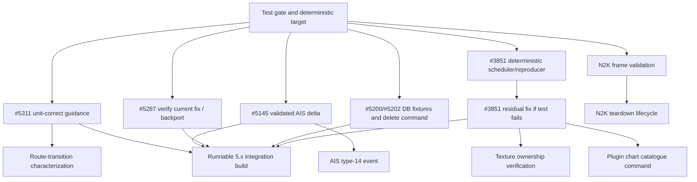

# OpenCPN 5.x core-hardening implementation plan

**Plan date:** 18 August 2026  
**Parent audit:** [OpenCPN open-issue and core-architecture audit](open-issue-core-architecture-audit.md)  
**Target:** a runnable OpenCPN 5.x development build containing independently reviewable, regression-tested fixes  
**Primary rule:** no architectural change without a defect, invariant, testability need or demonstrated second consumer

> **Execution status, 18 August 2026:** Pass 0, the five primary fix streams,
> and the evidence-gated secondary implementations are assembled on
> `hardening/5x-integration`. The Linux OpenGL application links and all 71
> deterministic tests pass. This means the patches are ready for developer
> review and platform/domain validation; it does not mean all clustered upstream
> issues are proven closed. See [HARDENING.md](../../HARDENING.md) and the
> [build manifest](hardening-build-manifest.md).

## 1. Outcome

Deliver an OpenCPN 5.x hardening line which developers and maintainers can build and exercise, while keeping every upstream-facing change small enough to review on its own.

The first development pass will provide:

1. a trustworthy deterministic test gate and sanitizer-safe test subset;
2. a standards-correct fix for #5311;
3. validated Signal K AIS input for #5145;
4. regression verification and, if needed, a stable backport of the current-master null-safe #5287 fix;
5. transactional route/routepoint deletion semantics for #5200/#5202, with migration fixtures covering #5144; and
6. deterministic verification of current-master #3851 lifecycle hardening, followed by a residual ownership fix only where the harness still fails.

The “five top defects” and “five starting changes” overlap but are not identical. Test infrastructure is enabling work, not a defect fix; #3851 is too risky to fold into another PR. Therefore Pass 1 is a sequence of at least seven upstream-sized PRs, not one large branch.

Secondary problems—N2K driver teardown, route-transition output, texture ownership, plug-in chart catalogue replacement and AIS type 14—enter implementation only after their stated evidence gates pass. Bounds checks and diagnostics which are correct independently may land earlier; speculative behavioural changes may not.

## 2. Non-goals and guardrails

- Do not rewrite OpenCPN, replace wxWidgets or create all proposed architectural libraries up front.
- Do not break the native plug-in ABI or require plug-in source changes for Pass 1.
- Do not combine unrelated fixes into a “modernization” PR.
- Do not change autopilot direction/XTE semantics without decoded sentence-sequence evidence and domain review.
- Do not delete persisted routepoints based only on lack of a route link; intentional marks and layer objects must be identified.
- Do not treat `shared_ptr` as a substitute for a chart/thread lifecycle contract.
- Do not make unstable integration/network/hardware tests mandatory in the same lane as deterministic unit tests.
- Do not backport directly to a stable release branch until the master fix and its tests have settled.
- Do not use the current dirty worktree as the source of release artifacts.

## 3. Repository and branch model

Use `pob220/OpenCPN-Core-Hardening` as the clean review and developer-test fork,
with the official repository retained as `upstream`. Its `master` branch is the
unmodified comparison baseline; topic branches remain directly comparable to
upstream. A second disconnected `Stock-OpenCPN` remote is not needed.

### 3.1 Clean worktrees

Create separate clean worktrees from the current upstream master:

```text
worktrees/opencpn-hardening-base       read-only comparison/build baseline
worktrees/opencpn-pr-<topic>           one worktree per active topic PR
worktrees/opencpn-hardening-integration runnable integration branch
```

The local `safer-renderer` work and untracked plug-ins/data must remain separate. Any useful experimental renderer code is introduced later through its own reviewed PR; it is not silently inherited by the hardening build.

### 3.2 Branches

Use one branch per reviewable change, for example:

```text
hardening/test-gate
fix/5311-n2k-vmg-units
fix/5145-signalk-ais-validation
test/5287-startup-readiness-regression
fix/5200-navobj-delete-invariants
test/3851-senc-lifetime-reproducer
fix/3851-senc-residual-lifetime
```

Maintain `hardening/5x-integration` as a developer-consumption branch containing only completed topic branches. It is not the source branch for a giant upstream PR. Rebuild it from accepted/rebased topic commits when necessary; never hide integration-only fixes on it.

### 3.3 Stable backports

After a fix has passed the master matrix and received maintainer feedback, assess a `Release_5.14.x` backport independently:

- #5311 and #5145 are plausible backports. #5287 appears already corrected on master and is a strong backport candidate after a regression test confirms it.
- #5200/#5202 require database/release-upgrade testing before backport.
- #3851 should be backported only if the ownership change is narrow and field-tested; otherwise ship on the next main release.

## 4. Definition of done

Every topic PR must meet all applicable criteria:

1. The issue's current behaviour is captured by a failing regression test, minimized input or deterministic harness before the fix.
2. The root cause is stated as proven, strong hypothesis or still unknown.
3. The production change is the smallest change which enforces the tested rule.
4. Existing UI and native plug-in entry points remain source/ABI compatible unless maintainers explicitly approve otherwise.
5. Unit/integration tests pass on the applicable Linux, Windows and macOS matrix.
6. Parser/storage/lifetime code runs under ASan and UBSan where supported; concurrency changes get focused TSan or equivalent assertions where practical.
7. User-data changes are transactional and tested across close/reopen and version migration.
8. Wire changes are tested by decoding emitted bytes/sentences, not by testing only an intermediate variable.
9. The PR includes issue link, risk statement, reproduction instructions and rollback/backport notes.
10. No unrelated formatting, renaming, file moving or container conversion is included.
11. The integration branch produces a runnable package and a manifest containing source commits and test results.

An issue is not marked fixed merely because the crash was not observed during one manual run.

## 5. Test and build environments

### 5.1 Deterministic unit environment

Create a lightweight test target which does not require a display, network, session bus, audio device or complete `wxApp`. Initial contents:

- navigation value/output tests;
- Signal K/AIS parsing tests;
- SQLite nav-object repository/migration tests;
- coordinate/geodesic tests;
- Actisense/NMEA framing tests;
- buffer and message value tests; and
- deterministic lifecycle schedulers/fakes.

Use temporary directories and databases unique to each test. Inject clocks, transports and schedulers where timing matters. Tests must not use fixed ports or the developer's real configuration.

### 5.2 Integration environment

Keep these separate and labelled:

- IPC/server tests requiring processes or a session bus;
- REST tests requiring sockets/network discovery;
- GUI first-run tests under Xvfb or the platform UI runner;
- chart catalogue/SENC tests with licensed or distributable chart corpora;
- plug-in compatibility tests; and
- physical N2K/autopilot hardware tests.

A failed integration lane remains visible and artifact-producing even when it is temporarily non-blocking. It must not be represented as a passing unit suite.

### 5.3 Sanitizer matrix

| Lane | Initial scope | Gate |
|---|---|---|
| ASan | deterministic parsers, nav values, SQLite and fake lifecycle tests | mandatory on Linux |
| UBSan | same subset plus N2K encoders/decoders | mandatory on Linux |
| TSan | focused fake N2K/SENC schedulers | advisory until noise is characterized, then mandatory per affected PR |
| macOS ASan | AIS and chart lifetime tests where runner permits | mandatory for macOS-specific fix before closure |
| Windows diagnostics | Debug assertions plus Application Verifier/ASan where toolchain permits | required for Windows-specific null/lifetime fixes |

Do not run the entire GUI under every sanitizer as the first milestone. Expand scope as deterministic boundaries emerge.

### 5.4 Platform build matrix

- Linux wxGTK with OpenGL.
- Linux wxGTK without OpenGL.
- Linux deterministic sanitizer lanes.
- Windows x64 Release and RelWithDebInfo.
- macOS current supported Intel/Apple Silicon configuration.
- Raspberry Pi/aarch64 build for SENC/S63 investigation when the corpus is available.
- Android compile/package smoke test after core changes which touch shared model code.

### 5.5 Test artifacts

For every integration build retain:

- packages/binaries;
- commit manifest and submodule versions;
- CMake cache summary;
- test XML and sanitizer logs;
- minimized malformed-input corpora;
- database schema/fixture version identifiers;
- chart corpus hashes without redistributing licensed data; and
- manual hardware test forms for N2K/autopilot results.

## 6. Delivery dependency map



The first four defect branches can proceed independently after the test target shape is agreed. #3851 characterization can also start immediately, but its production fix must follow the reproducer.

## 7. Pass 0 — make testing trustworthy

### PR 0A — CTest discovery and deterministic CI gate

**Objective:** make the stable subset discoverable with `ctest --test-dir <build>` and make failures fail CI.

**Current evidence:** root CTest reports “No tests were found”; Linux CI uses `continue-on-error`; the custom runner does not reliably propagate each process result; sanitized builds explicitly skip execution. The full custom target also mixes deterministic tests with IPC/REST environment failures.

**Likely files:**

- `CMakeLists.txt`
- `test/CMakeLists.txt`
- `.github/workflows/linux.yml`
- Windows/macOS workflows after Linux proves stable

**Sequence:**

1. Record the currently passing deterministic filters and known integration failures.
2. Enable/register testing at the correct directory scope.
3. Label unit, integration, network, DBus and GUI tests.
4. Replace unchecked `execute_process` sequencing with CTest invocations or explicitly checked results.
5. Make the deterministic lane blocking on Linux.
6. Publish JUnit output on failure.
7. Remove `continue-on-error` only for the deterministic lane.

**Acceptance:** a deliberately failing sample test makes CI red; the known environment-dependent tests do not run in that lane; local and CI test counts match.

### PR 0B — sanitizer-safe core test target

**Objective:** execute useful tests in sanitizer builds without initializing the whole GUI.

**Sequence:**

1. Create a small target/library from only the sources needed by navigation values, parsing and SQLite fixtures.
2. Move existing suitable tests to it without behavioural changes.
3. Run it under ASan/UBSan.
4. Add leak suppressions only for documented framework/toolchain allocations, never for project objects under test.

**Acceptance:** ASan and UBSan execute rather than print “tests disabled”; target has no display/network requirement; sanitizer findings fail the lane.

**Review size:** two PRs are preferred. If maintainers want one, keep production source untouched and keep the diff below roughly 400 lines.

## 8. Pass 1 defect stream A — #5311 N2K VMG units

### PR 1 — wire-correct PGN 129284

**Proven root cause:** `SendPGN129284` calculates VMG from `gSog` in knots and passes it to `SetN2kPGN129284`, whose closing-velocity field is metres/second.

**Tests first:**

1. Use a fake `AbstractCommDriver` to capture the emitted `Nmea2000Msg`.
2. Decode the payload using `ParseN2kPGN129284`.
3. Test 10 kn directly toward the waypoint → approximately 5.14444 m/s.
4. Test a 60° relative course → half closing speed.
5. Test moving away, zero, NaN SOG and NaN COG according to documented output policy.
6. Assert distance remains metres and bearings remain radians so the test protects adjacent units.

**Production change:** introduce a unit-named pure calculation or use the established knots-to-m/s conversion at the encoder boundary. Keep globals and `Routeman` in the adapter for this PR.

**Explicit exclusion:** current time-to-go uses range/SOG even though VMG is calculated. That may be a second correctness issue, but it requires its own semantics test and must not be silently folded into #5311.

**Likely files:**

- `model/src/autopilot_output.cpp`
- `model/include/model/autopilot_output.h`
- new focused test source under `test/`
- `test/CMakeLists.txt`

**Acceptance:** decoded wire value is correct within N2K field resolution; existing PGN 129283/129285 tests pass; no ABI change.

**Architecture earned:** the first pure, unit-explicit guidance value seam, later reusable by route-transition tests.

## 9. Pass 1 defect stream B — #5145 Signal K AIS validation

### PR 2A — reproduce and guard the reported crash

**Proven root cause:** `AisDecoder::handleUpdate` and `updateItem` use RapidJSON typed accessors without establishing the member type. Checked builds assert; unchecked builds violate accessor preconditions.

**Tests first:**

- exact issue payload;
- non-string/missing `timestamp`;
- non-string/missing `path`;
- null, boolean, string, object and array where numeric values are expected;
- non-object position/design records;
- wrong types for AIS class, navigation state, destination, ETA, MMSI and nested registration fields;
- out-of-range latitude/longitude and non-finite numeric values; and
- a valid mixed delta proving one rejected field does not corrupt unrelated valid fields.

**Immediate change:** add typed validation at every reached accessor in the reported path. Return/record a structured field error and rate-limit logging by path/source. Never allow a JSON exception/assertion to escape a network/event callback.

### PR 2B — separate validation from application

If PR 2A remains small, follow it with a distinct extraction:

```text
RapidJSON document
      -> validate/decode
      -> AisDelta value or ParseError list
      -> apply to AisTargetData
      -> selection/CPA/track notifications
```

The delta should use standard value types and carry only fields present in the update. Do not convert the entire AIS subsystem or replace RapidJSON in this PR.

**Likely files:**

- `model/src/ais_decoder.cpp`
- `model/include/model/ais_decoder.h`
- optionally a small `ais_signalk_delta.{h,cpp}`
- test data and focused tests

**Fuzzing:** add a persistent seed corpus and a decode-only fuzz target after deterministic tests. Bound document size, nesting and log output.

**Acceptance:** all invalid variants are rejected/ignored by policy without process failure; valid server payloads remain equivalent; target mutations are deterministic; macOS assertion reproduction is gone.

**Architecture earned:** hostile-input parsing becomes headless and reusable; AIS state/presentation remains unchanged initially.

## 10. Pass 1 defect stream C — #5287 startup readiness

### PR 3A — verify the current-master candidate fix

**Proven release root cause:** in 5.14, first-run asynchronous chart rebuild returns from `OnInitTimer` before final toolbar construction, while the Settings case dereferences `g_MainToolbar` unconditionally.

**Current-master status:** master now routes toolbar tooltip access through `HideTbarTooltip`, which checks `g_MainToolbar`. This is a credible existing production fix. The issue remains open and the code lacks an issue-linked regression, so the first task is verification, not a duplicate fix.

**Tests first:**

1. Represent deferred initialization phases without starting a real chart canvas.
2. During chart rebuild/pending initialization, invoking Settings through the menu must not dereference a toolbar.
3. Establish whether the settings dialog itself is safe at this phase. If it is, preserve that capability; if it is not, assert that it is disabled/ignored until `Ready`.
4. During `Closing`, late Settings and plug-in command events must be rejected.
5. Exercise menu invocation as well as toolbar invocation, since the menu can exist before the toolbar.

**Minimal master change:** ideally test-only if current master passes. If another unguarded path is reached, route it through the existing null-safe helper. Do not remove the asynchronous return and accidentally make chart rebuild re-entrant.

**Small boundary:** introduce an application readiness enum/capability such as `Starting`, `Ready`, `Closing`, `Closed` only if the test proves that constructing/opening Settings—not merely hiding a tooltip—is unsafe, or another real consumer requires it. Do not turn an already-fixed null dereference into an unnecessary lifecycle refactor.

**Likely files:**

- `gui/src/ocpn_frame.cpp`
- relevant frame/toolbar header
- a small readiness helper/test if needed

**Acceptance:** 5.14 baseline reproduces the null dereference, current master passes the same scenario, and any remaining availability policy is explicit. Subsequent launches and Android settings paths remain unchanged.

**Backport:** prepare the smallest helper/call-site backport plus regression for a 5.14 maintenance line if maintainers want one.

**Architecture earned:** null-safe capability access now; explicit readiness only if a second demonstrated problem earns it.

## 11. Pass 1 defect stream D — #5200/#5202 routepoint persistence

This stream is data-destructive if implemented incorrectly and therefore begins with schema/invariant tests rather than UI changes.

### PR 4A — database fixture and invariant suite

Build temporary SQLite fixtures for:

1. route with points used by no other route;
2. point shared by two routes;
3. explicit standalone mark;
4. route point promoted to a visible/shared mark;
5. layer-owned/read-only point;
6. circular route whose first/end GUID repeats;
7. pre-migration schema from 5.12/early 5.14;
8. HTML links/comments attached to affected objects;
9. simulated SQL failure halfway through deletion; and
10. close/reopen after every operation.

State the invariant before coding:

```text
Deleting a route deletes the route and its links atomically.
A point is deleted only when it has no remaining route links and policy says
it is route-owned rather than an intentional mark/layer object.
Shared or intentional points retain identity, metadata and visibility.
Failure leaves both route and point graph unchanged.
```

Confirm how route-owned versus intentional points are represented today. If current schema cannot distinguish them reliably, stop for maintainer input rather than infer from visibility alone.

### PR 4B — narrow transactional delete operation

**Current cause:** `NavObj_dB::DeleteRoute` deletes the route row; cascade removes relationship rows. `DeleteOrphanedRoutepoint` exists but is unused and deletes every unlinked routepoint indiscriminately.

**Change:** add one transaction-bound operation accepting route GUID and explicit orphan policy. It should:

1. collect candidate point GUIDs and their ownership/mark state;
2. delete route and relationship rows;
3. delete only eligible now-unlinked route-owned points;
4. preserve shared, standalone and layer points;
5. commit or roll back atomically; and
6. return a result containing deleted/preserved GUIDs and error details.

Keep selection-list and UI cleanup outside the repository but drive them from the returned result. Migrate one UI deletion path first, then the other equivalent paths in a mechanical follow-up after tests demonstrate equivalence.

**Likely files:**

- `model/src/navobj_db.cpp`
- `model/include/model/navobj_db.h`
- `model/src/navobj_db_migrator.cpp`
- new SQLite fixture tests
- one initial GUI deletion caller

**Do not initially:** redesign `Route`, convert all raw pointers, consolidate every import/update call, or change plug-in ABI.

**Acceptance:** all fixture invariants survive restart; forced failure rolls back; 5.12/5.14 migration preserves route order and repeated circular endpoints; both reported UI reproductions pass.

**Architecture earned:** first narrow nav-object command/repository boundary. Later UI and HostApi adapters can reuse it.

## 12. Pass 1 defect stream E — #3851 SENC/cache lifetime

The 5.14/local baseline has a weak raw-ticket/thread implementation. Live upstream master is materially newer: it invalidates ticket chart pointers from `s57chart` destruction, tracks completing tickets, locks job lists, suppresses duplicate completion and calls `ClearJobList` during manager destruction. This work may already solve the original cache-purge failure and must be preserved/tested.

Residual concerns visible in current master are not proof of a crash but deserve the harness: workers are detached; `m_shutting_down` is read/written across threads without an explicit atomic/lock contract; shutdown waits a fixed five seconds and then deletes tickets even if a worker has not reached a terminal state; events still carry raw ticket pointers. The task is to verify these interleavings and fix only failures, not replace the newer implementation wholesale.

### PR 5A — deterministic verification of current-master SENC lifecycle

**Objective:** reproduce the maintainer-described cache-purge race without depending on timing or a full GUI.

Introduce a fake/minimal job payload and controlled scheduler capable of pausing at:

- pending before start;
- worker started before chart ingest;
- ingest in progress;
- completion event queued but not handled;
- completion handled; and
- manager/application shutdown.

Run the same matrix against both the 5.14 baseline and current master. For every phase request cache purge/chart destruction and assert the intended outcome. Instrument ticket ID, chart identity/path, state transitions, owner and completion/cancellation. Assert:

- one terminal state per ticket;
- no completion callback after manager destruction;
- no chart dereference after its lifetime ends;
- pending queue is bounded or backpressured; and
- purge either waits, cancels safely or skips pinned charts according to explicit policy.

If a distributable S57 cell is available, add an integration variant. The core state-machine test must not require licensed charts.

### PR 5B — repair only reproduced residual ownership failures

If current master passes the original purge case and all shutdown cases under sanitizers, this PR is unnecessary: retain PR 5A as regression evidence and propose closing #3851. If it fails, choose the smallest change which passes the reproducer. Likely properties:

- manager cannot delete a ticket while a detached worker or queued event can still access it;
- worker lifetime reaches a proven terminal state before manager destruction, whether by join, ref-counted shared state or another explicit protocol;
- ticket carries immutable build inputs and cancellation/terminal state;
- a chart/cache entry cannot be purged while an active ticket requires it, or the worker no longer requires a live chart object at all;
- event payload cannot outlive the ticket; and
- shutdown cancels pending jobs, waits for running work within a documented bound, then drains queued completion events.

Prefer copying immutable SENC build inputs into the job if the worker only needs path/ref/LOD. That may remove the need to pin `s57chart`. Do not assume this is safe until the worker/data flow confirms it.

### PR 5C — bounded scheduling and field regression

If queue growth contributes to pressure, add explicit maximum pending work/backpressure and visible progress/cancellation. Test “prepare all charts,” normal on-demand chart opening, cache pressure and shutdown on Linux/macOS. Record memory and elapsed-time deltas.

**Likely files:**

- `gui/include/gui/senc_manager.h`
- `gui/src/senc_manager.cpp`
- S57 chart/cache purge call sites
- focused scheduler/lifetime tests
- possibly frame shutdown only where the new contract requires it

**Acceptance:** current-master candidate fixes pass the original cache-purge interleavings under ASan/TSan; any residual shutdown interleaving is fixed; ticket deletion cannot race a worker/event; shutdown policy is bounded and diagnosed; normal SENC output is byte/semantically equivalent; memory/throughput regression is acceptable.

**Architecture earned:** one explicit asynchronous resource-lifetime convention. It is not yet a generic jobs subsystem.

## 13. First runnable hardening build

After PRs 0A, 0B, 1, 2A/2B, 3, 4A/4B and 5A/5B pass their matrices, assemble `hardening/5x-integration` and publish a development build.

The build must:

- identify itself as an unofficial hardening build with base OpenCPN version and commit manifest;
- use a separate default configuration/profile or clearly document backup/restore;
- never silently migrate the only copy of a user's nav-object database during testing;
- include exact reproduction scripts/data for the five issue groups where redistributable;
- include a test checklist for first-run, Signal K, route deletion/restart, N2K output and SENC cache pressure; and
- provide rollback instructions to the official release.

The integration build is successful when developers can reproduce the old failure on the parent/baseline build and demonstrate the fixed result on the integration build using the same input or scripted steps.

## 14. Evidence-gated secondary streams

These investigations may run alongside Pass 1, but production changes must not delay the five primary fixes unless they expose a shared prerequisite.

### 14.1 N2K serial framing and teardown — #4554, #3316, #4686

#### Gate 1 — independently correct input hardening

Build an Actisense byte-stream corpus and pure decoder tests covering truncated, escaped, oversized and malformed management/application packets. Current code copies eight bytes in `PayloadToName` without checking length and indexes packet-specific fields without a prior minimum-size contract. These guards can land independently because valid packets are unaffected.

Deliverables:

- pure/bounded frame decoder or validation helpers;
- safe NAME extraction only where the packet actually contains NAME;
- exception containment at the wx event boundary;
- rate-limited diagnostics including interface and rejection reason; and
- propagation of actual send failure to callers.

#### Gate 2 — deterministic lifecycle reproduction

Provide a fake serial transport whose read can block, fail, return partial data and be interrupted. Repeat open/send/close/destruct while queuing events. The test must demonstrate whether a callback/thread can outlive `CommDriverN2KSerial`.

Only then change teardown:

- explicit `Opening/Running/Stopping/Stopped/Failed` states;
- one stop request;
- interrupt blocking I/O;
- join/`Wait` before parent destruction;
- no raw callback to destroyed owner;
- atomics or mutex for every cross-thread state; and
- bounded close with a diagnosed failure path rather than pointer abandonment.

#### Hardware validation

Test at least Actisense NGT-1 plus available alternative gateways on Windows, macOS and Linux. Scenarios: receive-only, transmit route PGNs, concurrent N0183 network input, cable removal, device fault, app shutdown and rapid connection reconfiguration.

**Fix threshold:** mark #4554/#3316/#4686 fixed only when their individual reproductions or matching symbolized stacks pass. A safer teardown without reproduction is hardening, not proof of closure.

### 14.2 Autopilot route transitions — #4103

This is safety-sensitive. The first deliverable is a characterization package, not a semantic fix.

Capture APB, RMB, XTE and relevant N2K output for:

- left/right cross-track position;
- approaching arrival circle;
- arrival and automatic next-leg activation;
- overshooting a waypoint;
- acute/obtuse/reversal leg changes;
- forward and reversed routes;
- magnetic/true output; and
- loss/reacquisition of valid GNSS.

Decode every sentence/PGN into a normalized guidance timeline containing active leg, bearing, XTE magnitude/sign, direction-to-steer, arrival flags and timestamp. Review expected results with NMEA semantics and maintainers who have Raymarine and other autopilot experience.

If a defect is proven, change a pure guidance-state calculation established by #5311, then re-encode through existing NMEA adapters. Do not add device-brand special cases without field evidence and an explicit compatibility policy.

**Fix threshold:** simulator replay plus at least one affected hardware reproduction, or maintainer acceptance of a standards-based result where hardware is unavailable.

### 14.3 Asynchronous texture ownership — #4842, #4983

First determine whether PR #4914 already fixed #4842. Build a macOS stress runner which repeatedly pans, zooms, clears/rebuilds texture cache, closes charts and exits while jobs are pending. Record ticket/resource identifiers and completion order.

Reuse only the **lifecycle convention** proven by the SENC work; do not merge SENC and GL job implementations automatically. Texture jobs have GPU-context and thread-affinity constraints which SENC jobs do not.

Possible production change after reproduction:

- completion tokens which cannot reference a destroyed factory/cache;
- explicit cancel/drain before GL context/cache destruction;
- generation IDs to discard stale completions; and
- bounded ownership so shared references do not retain unlimited textures.

**Fix threshold:** reproduce parent failure or invalid lifetime assertion; pass deterministic completion-order tests and macOS stress with measured memory.

### 14.4 Plug-in chart catalogue replacement — #5170

Instrument `AddChartToDBInPlace`/remove paths, chart database generation, open chart references, canvases and plug-in callbacks. A test plug-in should add/remove a small chart repeatedly while one or more canvases query/open charts and during startup/shutdown.

The likely target is a serialized chart-catalogue command:

1. validate request and main-thread/application phase;
2. prepare updated catalogue/snapshot without invalidating readers;
3. quiesce affected chart jobs/open charts;
4. atomically publish the new catalogue generation;
5. notify canvases/groups once; and
6. persist atomically with recovery on failure.

Keep `AddChartToDBInPlace`, `RemoveChartFromDBInPlace` and native ABI signatures as adapters. Do not make plug-ins hold a new C++ catalogue type.

**Fix threshold:** the supplied plug-in reproduction runs repeatedly, no stale-generation access is observed, and the next startup reads a valid catalogue after forced interruption.

### 14.5 AIS type-14 safety messages — #5069

Before changing behaviour, confirm with maintainers and the governing AIS standard:

- which station classes may originate type 14;
- whether a message is valid without prior target/position state;
- retention and expiry;
- duplicate/rate handling;
- acknowledgement requirements; and
- notification/alarm policy.

Use the issue's sample sentences plus verified class A, class B, SART, base-station and no-position cases. Separate three questions in tests: decode validity, domain event creation and UI presentation.

If confirmed, introduce an `AisSafetyMessage` value/event carrying MMSI, text, reception time and source. Annotate an existing target when present but do not require or manufacture a target. Existing target/UI code remains a consumer; future plug-in subscriptions may use the same event through a compatibility adapter.

**Fix threshold:** standards/UX decision recorded, corpus passes, flooding is bounded and existing SART presentation does not regress.

## 15. Progressive architectural stages

Architecture advances only when the preceding fixes demonstrate the boundary.

### Stage 0 — baselines, diagnostics and regression protection

Deliverables:

- Pass 0 test/CI PRs;
- build/test manifests;
- sanitizer execution;
- crash symbolization instructions;
- minimized corpus conventions; and
- explicit evidence labels in issue/PR descriptions.

Exit criteria:

- deterministic test count is stable across local/CI;
- a failing test reliably fails CI;
- ASan/UBSan execute real tests;
- integration/hardware failures are visible but isolated; and
- developers can build the official baseline and integration branch from documented commands.

### Stage 1 — high-confidence defect fixes

Deliverables:

- #5311, #5145, #5287, #5200/#5202 and #3851 streams;
- first hardening integration build;
- verified closure/backport recommendations; and
- no production architecture beyond the seams each fix earns.

Exit criteria:

- every old reproduction fails on baseline and passes on hardening build;
- persistence survives restart/migration;
- wire bytes decode correctly;
- malformed inputs cannot terminate the process; and
- chart jobs are safe under deterministic purge/shutdown interleavings.

### Stage 2 — pure functionality and validated inputs

Candidates:

- unit-explicit route guidance calculations from #5311/#4103;
- longitude short-arc operations from #5304;
- validated AIS delta from #5145;
- Actisense frame decoder;
- GPX/import conflict values;
- chart-ingest result/quarantine from #3570; and
- navigation freshness/identity values from #1961/#4670.

Rules:

- use standard value types internally where they improve tests and contracts;
- translate wx/API objects at existing edges;
- preserve output equivalence unless a defect test requires change; and
- avoid a catch-all `domain` library until several stable values share minimal dependencies.

Exit criteria:

- extracted functions link into a lightweight headless target;
- callers use them through thin adapters;
- edge cases include antimeridian, poles, NaN, stale time and malformed input; and
- no duplicated old/new calculation remains without an equivalence test.

### Stage 3 — consolidate ownership and state boundaries

Candidates:

- expand the nav-object command/repository from deletion to one import/update operation;
- route activation/guidance state service;
- navigation snapshot with value, provenance, reception/source time and validity;
- driver lifecycle state contract;
- chart job/resource generation contract; and
- application readiness/closing capabilities.

Rules:

- one use case per PR;
- migrate UI path first, then legacy plug-in adapter;
- keep raw legacy objects at the facade until equivalence is demonstrated;
- ownership must name the thread and destruction order; and
- remove obsolete paths only after release-level equivalence evidence.

Exit criteria:

- UI and native API call the same command for migrated operations;
- transaction/lifetime results are explicit;
- globals are no longer the authoritative input for migrated computations; and
- startup/shutdown assertions catch late access deterministically.

### Stage 4 — stable internal services and extension adapters

Promote only facilities with real core and plug-in consumers:

1. read-only navigation snapshot/subscription;
2. geodesic and route-guidance calculations with explicit units;
3. route/waypoint commands with result/error/transaction semantics;
4. AIS target/safety events;
5. chart catalogue/query capability after chart lifetime settles; and
6. bounded jobs/cancellation only if SENC, texture and another consumer share compatible needs.

The service definition must not depend on a particular host mechanism. Native C exports and HostApi121/122 adapt to it. A future alternate host is another adapter, not a replacement core.

Exit criteria:

- at least two demonstrated consumers or one critical invariant per service;
- versioned capability/data contract;
- headless tests independent of plug-in loading;
- existing plug-ins unchanged; and
- no duplicate mutation logic behind native API and UI.

### Stage 5 — larger simplification only where justified

Possible later work:

- independently linkable core libraries for already-extracted values/services;
- narrower model target dependencies;
- chart catalogue/ingest separation from portrayal where job boundaries prove it;
- deletion of duplicated legacy orchestration; and
- file/directory organization following real build boundaries.

Do not enter Stage 5 based on aesthetic goals. Require measured build/test benefit, reduced defect surface or multiple consumers.

## 16. Integration, compatibility and release validation

### 16.1 Automated acceptance suite

The hardening build must run:

- deterministic unit suite on all desktop platforms;
- ASan/UBSan subset;
- old/new SQLite migration and rollback fixtures;
- exact Signal K/AIS malformed corpus;
- decoded N2K output assertions;
- first-run GUI scenario;
- SENC scheduler/purge/shutdown matrix;
- native plug-in load/API smoke tests; and
- startup/shutdown repetition with pending events/jobs.

### 16.2 Manual field matrix

Maintain a result sheet containing hardware/OS, input device, plug-ins, chart types and test commit. Minimum desirable coverage:

- Actisense NGT-1 receive/transmit and shutdown;
- one non-Actisense N2K gateway;
- Raymarine or affected autopilot transition replay;
- macOS GL texture/cache stress;
- S57 and, where licensing permits, S63 on Raspberry Pi/aarch64;
- Windows first-run chart database rebuild/settings access;
- Signal K server variants; and
- shared routepoint operations through both UI and one plug-in/API caller.

Manual results supplement deterministic tests; they do not replace them.

### 16.3 Plug-in compatibility

Smoke-test representative plug-in categories:

- dashboard/navigation consumer;
- GRIB/weather overlay;
- route-producing Weather Routing;
- chart provider/manager where available;
- WMM messaging for magnetic variation; and
- AIS/navigation subscription consumer.

Check load/unload, API version negotiation, route add/update/delete, chart add/remove, overlay redraw and shutdown. No plugin binary should need rebuilding solely because of Pass 1.

### 16.4 Developer release package

Publish per-platform artifacts where existing CI/signing permits. Include:

- `HARDENING-NOTES.md` with fixed issues and known limitations;
- source commit manifest;
- test result links;
- configuration/data backup warning;
- reproducible verification steps; and
- explicit “unofficial development build—not for primary navigation” wording until maintainers release it.

## 17. Risk register and stop conditions

| Risk | Mitigation | Stop condition |
|---|---|---|
| Test gate exposes existing flakes | separate deterministic/integration labels; fix gate infrastructure first | deterministic lane cannot reproduce locally/CI |
| #5145 rejects tolerated server data | corpus from multiple servers, field-level diagnostics, partial-update policy | valid real server payload regresses |
| #5200 deletes user marks | explicit ownership invariant, backups, transactions, migration fixtures | schema cannot distinguish route-owned and intentional points |
| #3851 fix stalls UI or retains charts | deterministic scheduler plus memory/latency measurement | safe lifetime requires unbounded wait/retention |
| N2K join hangs on platform serial API | interruptible fake and real-device tests | blocking read cannot be cancelled safely on a supported platform |
| Autopilot change causes field hazard | characterization and hardware review before behaviour | expected XTE/direction semantics remain disputed |
| Plugin catalogue service breaks ABI/lifetime | keep exports as adapters and test binaries | change requires existing plugin rebuild/ABI break |
| Integration branch diverges | topic-only commits, manifest, frequent upstream rebase | hidden integration-only production changes appear |
| Scope expands into rewrite | one issue/invariant per PR and explicit exclusions | PR cannot be reviewed/tested independently |

## 18. Issue and PR evidence template

Every implementation PR should contain:

```text
Issue(s):
User-visible failure:
Baseline commit/version:
Reproduction or corpus:
Root-cause confidence: proven / strong hypothesis / weak hypothesis
Invariant being established:
Tests added before fix:
Production change:
Compatibility/ABI/persistence impact:
Platforms exercised:
Sanitizer result:
Backport assessment:
Known unanswered questions:
Follow-on deliberately excluded:
```

This makes maintainers able to accept a local fix even if they decline the follow-on architecture.

## 19. Concrete execution order

The default order is:

1. Create clean upstream worktrees and capture baseline build/test manifests.
2. PR 0A: CTest discovery and blocking deterministic CI.
3. PR 0B: sanitizer-safe core test target.
4. In parallel after target shape stabilizes: tests/fixes for #5311 and #5145, plus current-master verification/backport work for #5287.
5. PR 4A: nav-object fixtures and written ownership invariant.
6. PR 4B: transactional #5200/#5202 deletion.
7. PR 5A: deterministic #3851 lifetime reproducer.
8. PR 5B: SENC ticket/worker/chart residual ownership fix only if current master fails PR 5A's matrix; otherwise propose closure with the regression evidence.
9. PR 5C only if queue/backpressure is separately demonstrated.
10. Assemble and publish the first hardening integration build.
11. Run the full platform/plugin/manual matrix and prepare narrow stable backports.
12. Begin N2K frame hardening and teardown harness.
13. Characterize #4103 and verify #4842/#4983 against current code.
14. Implement #5170 and #5069 only after their evidence/semantics gates.
15. Progress through Stages 2–4 one proven boundary at a time.
16. Reassess Stage 5 only after at least one release has exercised the new services.

If PR 0 work becomes contentious, #5311 may still land with a directly invoked focused test, but the broader programme should not proceed into persistence or concurrency changes without a trustworthy gate.

## 20. Immediate next actions

1. Refresh `upstream/master`, record the exact commit and create clean topic/integration worktrees.
2. Open a tracking milestone/project containing the PR sequence and evidence gates.
3. Capture current Linux/macOS/Windows test discovery and known failures as artifacts.
4. Draft PR 0A without production changes.
5. In a separate topic worktree, add the failing decoded-wire test for #5311.
6. Preserve the #5145 payload and build the malformed Signal K table corpus.
7. Build the minimal first-run harness for #5287 and compare 5.14 against current master's `HideTbarTooltip` path.
8. Ask maintainers the routepoint ownership/schema question before enabling deletion.
9. Convert #3851's reported interleaving into the controlled scheduler test and run it against current master's newer invalidation/completion code before changing ownership.
10. Identify volunteers/hardware for Actisense, autopilot, macOS texture and Raspberry Pi S63 validation.

The programme should continuously produce usable results: test reliability first, then small correctness fixes, then one stateful invariant, then one asynchronous lifetime contract. A more testable core emerges from these accepted fixes; it is not a prerequisite imposed before them.
