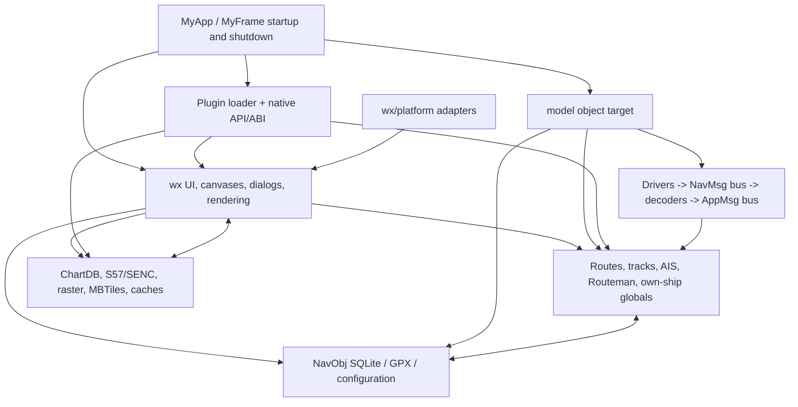
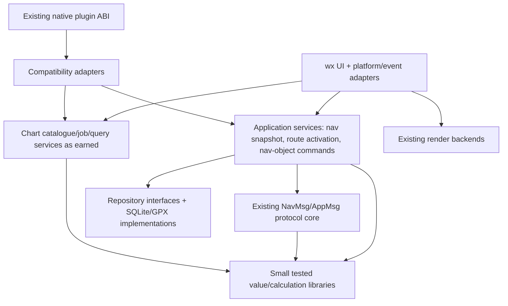

# OpenCPN open-issue and core-architecture audit

**Audit date:** 18 August 2026  
**Issue snapshot:** 319 open issues and 36 open pull requests (355 open items reported by GitHub)  
**Code baselines:** `Release_5.14.0` (`91f3b674`), live upstream `master` archive (`e87d223` at audit time), and the local `safer-renderer` branch (`8493742b`)  
**Scope:** diagnosis and planning only; no production behaviour was changed

> **Implementation update:** The audit snapshot remains the evidence record.
> Reviewable fixes and hardening experiments have since been implemented on
> topic branches and assembled on `hardening/5x-integration`. See
> [HARDENING.md](../../HARDENING.md) and the
> [build manifest](hardening-build-manifest.md) for tested results and remaining
> platform/domain validation. The classifications below are not retroactively
> rewritten to claim that an open upstream issue is closed.

**Implementation programme:** [OpenCPN 5.x core-hardening implementation plan](core-hardening-implementation-plan.md)

## 1. Executive summary

OpenCPN does not need a rewrite, nor is “modern C++” a useful top-level goal. It does need a sustained programme which makes correctness rules, ownership and lifetimes explicit at the points where current defects demonstrate that they are not explicit enough.

The backlog is dominated numerically by requests rather than urgent defects. The GitHub labels contain 182 `enhancement` and 106 `bug` labels, but labels overlap and are not reliable severity indicators. The audit classification has 179 feature/enhancement items, 78 serious functional defects, 23 possible crash/hang/data-integrity items, five safety/navigation-correctness items, and a small set of build, usability, debt, support and likely-resolved items. Most old issues need reproduction before engineering work. Age alone is not priority.

The highest-confidence immediate defects found in code are:

1. [#5311](https://github.com/OpenCPN/OpenCPN/issues/5311): PGN 129284 closing velocity is calculated in knots and passed to an NMEA 2000 encoder which requires metres/second. This is a proven navigation-output error and a small fix.
2. [#5145](https://github.com/OpenCPN/OpenCPN/issues/5145): Signal K AIS updates call RapidJSON typed accessors without checking the incoming type. A schema-drifted or malformed delta can assert in checked builds and invoke invalid behaviour otherwise.
3. [#5287](https://github.com/OpenCPN/OpenCPN/issues/5287): release 5.14 first-run initialization can return before the main toolbar is created, while the settings event unconditionally dereferences it. Current upstream master contains a null-safe `HideTbarTooltip` candidate fix, but an issue-linked regression and stable backport are still needed.
4. [#5200](https://github.com/OpenCPN/OpenCPN/issues/5200) and [#5202](https://github.com/OpenCPN/OpenCPN/issues/5202): deleting routes removes link rows but leaves route-only routepoints in the database. The existing orphan-removal helper is unused and, if called indiscriminately, would also remove legitimate isolated marks.
5. [#3851](https://github.com/OpenCPN/OpenCPN/issues/3851): maintainer analysis identifies a chart-cache purge racing outstanding SENC work. Current upstream master has since added chart-pointer invalidation, completion tracking, list locking and shutdown handling. These are candidate fixes, not closure proof; detached-worker/ticket lifetime still needs deterministic review.

Three additional high-risk clusters deserve characterization before behavioural changes: N2K serial driver teardown/input validation ([#4554](https://github.com/OpenCPN/OpenCPN/issues/4554), [#3316](https://github.com/OpenCPN/OpenCPN/issues/3316), [#4686](https://github.com/OpenCPN/OpenCPN/issues/4686)); chart/texture asynchronous ownership ([#3851](https://github.com/OpenCPN/OpenCPN/issues/3851), [#4983](https://github.com/OpenCPN/OpenCPN/issues/4983), [#4842](https://github.com/OpenCPN/OpenCPN/issues/4842)); and route-transition output semantics ([#4103](https://github.com/OpenCPN/OpenCPN/issues/4103)). The last is safety-relevant and should not be changed without deterministic sentence-sequence tests and hardware-domain review.

Architecture is contributing to some current bugs, but not all. The strongest evidence is not old syntax; it is duplicated multi-object updates, globally replaceable managers with borrowed raw references, asynchronous jobs without an explicit lifetime contract, and domain objects whose destruction requires rendering callbacks. Conversely, OpenCPN already has useful architectural seeds: `gui/` depends on `model/` while no `model/` file directly includes `gui/`; communications already separates drivers, raw `NavMsg` and decoded `AppMsg`; geodesic functions are headless; database migrations now have a framework; and API 1.21/1.22 provides a versioning path. These should be strengthened, not replaced with a speculative layer diagram.

The recommended long-term direction is a **tested service kernel grown from existing seams**, not a parallel application. Pure value calculations and input validation sit at the centre; stateful application services own route activation, nav-object transactions and navigation snapshots; existing wx event buses and UI become adapters; and the native plug-in API remains a compatibility facade over the same internal services. Start with services having two real consumers or one demonstrated invariant. Do not create all of `ocpn-domain`, `ocpn-application`, `ocpn-charts`, and so on in advance.

## 2. Method and confidence

The complete backlog was retrieved using GitHub's REST API with `state=open&per_page=100` until the terminal page. Pages contained 100, 100, 100 and 55 items. Removing 36 pull requests produced 319 issues and reconciled exactly with GitHub's 355 open-item count. The snapshot is classified in [open-issue-core-architecture-audit-issues.csv](open-issue-core-architecture-audit-issues.csv). The generating tool, including explicit code-reviewed overrides, is [`tools/open_issue_audit.py`](../../tools/open_issue_audit.py).

Every issue received metadata/title/body triage. Threads and implementation were reviewed for the higher-risk clusters and selected representative issues. The CSV's `audit_depth` field makes this distinction explicit. “Not code-verified” does not mean invalid; it means the audit does not pretend that taxonomy is diagnosis.

Conclusions use these terms:

- **Proven:** the failing statement/invariant or a maintainer-confirmed causal path is visible in current code.
- **Strong hypothesis:** code contains a matching hazard and reports fit it, but the exact failing interleaving/input is not reproduced.
- **Weak hypothesis:** plausible location only; collect evidence before changing code.

The repository worktree contained unrelated user plug-ins and data changes. They were preserved. A clean test build therefore used `/tmp/opencpn-audit-build` with plug-ins skipped. A stable comparison worktree was created at `/tmp/Stock-OpenCPN`; no new remote repository was created.

## 3. Current architecture map



This diagram is intentionally not a directory diagram. The CMake `model` target is an object aggregation linked with wxWidgets, GDAL, NMEA libraries, SQLite, networking, sound, JSON, service discovery and other facilities. It contains useful non-UI code but is not an independently linkable domain core.

### Observed dependency facts

- There are 233 C++ headers/sources under `model`; 129 include wx headers. No `model` source directly includes a `gui/` header, while 152 `gui` sources include `model/`. The source direction is therefore healthier than “everything depends on everything,” but wx types and global state still prevent a lightweight headless core.
- `Route` inherits `wxObject` and combines geometry, persistence identity, visibility, drawing style, planning state and raw `RoutePoint*` membership. `RoutePoint` carries wx/rendering state and has a static GL texture-deletion callback described in its own code as a “Horrible Hack.” Destruction of a navigation object can therefore require a renderer-installed side effect.
- `Routeman` owns route-activation calculations but also NMEA output context, pens/brushes, dialog-facing event variables and global collaborators. `Track` is a `wxEvtHandler` with a timer and progress-dialog concerns.
- `NavObj_dB` is a singleton taking raw `Route*`, `Track*` and `RoutePoint*`, and some import/migration methods accept frames/progress dialogs. Persistence operations and presentation remain coupled.
- Startup manually allocates a broad graph of global managers and selection lists. `MyFrame::OnCloseWindow` then performs a long, order-sensitive sequence: plug-in pre-shutdown, saving, timers, track stop, object deletion, plug-in deactivation, database close, canvas destruction, plug-in unload, configuration/AIS/multiplexer deletion, driver close and GL-thread draining. `MyApp::OnExit` deletes further globals. Some ordering is necessary—for example plug-in windows can be canvas children—but the contract is procedural and hard to test.
- The plug-in chart mutation path `AddChartToDBInPlace` saves the database, deletes global `ChartData`, creates a replacement and refreshes canvases. This is direct evidence that a public operation can invalidate borrowed references held throughout the UI/plug-in graph.
- The communications design is comparatively strong. Drivers publish typed raw messages; decoders publish application messages; addresses and payloads commonly use standard value/shared types. However, `NavMsgBus` remains a wx event handler/singleton and driver lifecycle rules are inconsistent.

### Major data flows

**Position/navigation:** transport driver → `NavMsgBus` → protocol decoder/`CommBridge` → global own-ship values plus `AppMsgBus` → `MyFrame` validity/interpolation/UI → route manager and autopilot output. The buses are useful seams; global own-ship variables and GUI-owned validity state are the main impediments to deterministic replay.

**Routes/waypoints:** UI or plug-in API → raw `Route`/`RoutePoint` mutation → selection index + global route list + `NavObj_dB` updates + GUI events. The same logical operation is implemented in multiple call paths. A failure or ordering difference can leave memory, selection and persistence views inconsistent.

**Charts:** directories/plug-in chart providers → `ChartDatabase` catalogue → chart objects → quilt/canvas → software/OpenGL render paths and asynchronous SENC/texture jobs. Cache ownership and background work cross the model/render boundary; chart plug-ins further constrain unload ordering.

**AIS:** NMEA/Signal K messages → `AisDecoder` target map → selection index, CPA calculations, track state, alerts/dialogs. Parsing, target-state mutation and GUI selection are performed in one update path, making malformed-input tests unnecessarily expensive.

## 4. Backlog statistics and taxonomy

The snapshot spans 2013–2026. Open issues by opening year are: 2013: 1, 2014: 2, 2017: 1, 2018: 4, 2019: 7, 2020: 6, 2021: 22, 2022: 24, 2023: 34, 2024: 54, 2025: 79 and 2026: 85. The growth is not itself proof of deteriorating quality: many entries are feature discussions and retained long-term ideas.

The audit taxonomy is:

| Class | Meaning | Count | Interpretation |
|---|---|---:|---|
| A | Safety/navigation correctness | 5 | Review first, but some require more evidence before a fix. |
| B | Crash/hang/data integrity | 23 | Mixture of proven defects, hardware-specific reports and old crashes. |
| C | Serious functional defect | 78 | Triage by reproducibility, affected population and leverage. |
| D | Build/release | 1 | Many build proposals carry enhancement labels and are counted H. |
| E | Performance/resource | 13 | Profile before architectural action. |
| F | Usability/UI | 10 | Usually local fixes. |
| G | Architecture/debt | 1 | Deliberately narrow; architecture is also assessed through defect clusters. |
| H | Feature/enhancement | 179 | Not defects; retain product-owner prioritization. |
| I | Documentation/support | 3 | Redirect or close when resolved. |
| J | Likely fixed/stale | 6 | Verify against a release and close with evidence. |

This model prioritizes credible impact, occurrence/reproducibility, affected population, architectural leverage and change risk. It does not multiply invented numeric scores. In navigation software, a rare but credible wrong-output issue can outrank a popular cosmetic request; an old unsymbolized crash can still rank below a deterministic local null dereference.

## 5. Top correctness and stability risks

| Rank | Issue/cluster | Risk | Confidence | Recommended disposition |
|---:|---|---|---|---|
| 1 | #5311 N2K VMG units | Wrong navigation data transmitted to external equipment | Proven | Fix and encode/decode-test immediately. |
| 2 | #5145 Signal K AIS types | Crash/assert on network input | Proven | Validate at parse boundary; add corpus tests/fuzzer entry. |
| 3 | #5200/#5202 nav-object deletion | Persistent orphaned/visible waypoints; integrity drift | Proven | Add database invariant tests, then transactional deletion. |
| 4 | #5287 first-run toolbar | Deterministic first-run null dereference in 5.14 | Proven; candidate master fix present | Add regression, verify master, then backport/close rather than duplicate the fix. |
| 5 | #3851 S57 cache/build race | Use-after-free/double-free and chart failure | Proven historical cause; candidate master hardening present | Test current invalidation/completion/shutdown logic and repair only remaining lifetime gaps. |
| 6 | #4554/#3316/#4686 N2K serial | Runtime and shutdown crashes; possible concurrent input trigger | Strong hypothesis | Add byte-stream/lifecycle harness, bounds checks, join contract. |
| 7 | #4103 route transition | Potential wrong direction command to autopilot | Medium | Capture current NMEA sequences; no at-sea semantic change yet. |
| 8 | #4983/#4842 GL textures | EXC_BAD_ACCESS during asynchronous cache work | Strong hypothesis / possibly partially fixed | Verify #4914, add stress/lifetime regression. |
| 9 | #5170 plug-in chart mutation | Intermittent crash and poisoned next startup | Strong hypothesis | Serialize chart-catalogue replacement and stop exposing replacement lifetime. |
| 10 | #4670 AIVDO ownship teleport | Grossly false own-ship position | Proven external-input mismatch; policy undecided | Add configurable own-MMSI consistency validation and diagnostics. |
| 11 | #5069 AIS type 14 | Safety broadcasts may be hidden/lost | Medium | Verify M.1371 interpretation and UX, then test standalone/class variants. |
| 12 | #5364 S63 rebuild hang/OOM | Charts unavailable after catalogue corruption | Medium report, low root-cause confidence | Reproduce with six-cell corpus and distinguish core CLI from S63 host interaction. |

The report does **not** group every 5.14 chart crash together. #5296 changed scope during its thread and later evidence points toward o-charts persistent/EULA state; #5248 stopped reproducing after directory reset; #5231 contains Intel Arc/Windows/plug-in evidence. They may share an initialization/catalogue boundary, but claiming the confirmed S57 cache race as their cause would be unjustified.

## 6. Likely stale, duplicate or resolved groups

- #5144 is a real schema-migration omission, but upstream master now contains a migration changing `routepoints_link` identity to `(route_guid, point_order)`. Verify an actual 5.12→current database fixture, then close or retarget it to the release branch.
- #4432 carries `done` and was fixed by PR #4434. Verify the tide-time regression test and close.
- #3412 carries `done`; commit `84f2b70bf` reportedly implements active-track recovery. Exercise crash recovery and close if the persisted tail is sound.
- #4119 carries `done` and describes a 5.10 Flatpak S63 permit mismatch. Confirm the current packaging/plugin result and close or move to support.
- #1325 is a 2018 multi-canvas crash against substantially changed rendering code. It is useful historical evidence, not a current work item without reproduction.
- #4842 may have been addressed by the shared-ownership work in PR #4914. It should not remain indefinitely ambiguous: run its macOS pilot-chart stress case and either close or record the remaining failing interleaving.
- #5200 and #5202 are two manifestations of the same routepoint persistence invariant. Keep both linked, implement once, and close together after separate UI-level reproductions pass.
- #3190 and #3189 form the GUID/import-invariant cluster; merge product decisions into one design note before coding.
- #4554, #3316 and #4686 overlap but should not yet be closed as duplicates: shutdown, concurrent input and transmit paths may enter the same driver lifetime hazard through different routes.
- #5296, #5248, #5231 and #5306 should remain distinct until crash addresses are symbolized. Their current symptom overlap is not adequate duplicate evidence.

Support requests and broad feature RFCs should not compete in the defect queue. In particular, requests for voyage recording, broad navigation-safety route planning, Android repository consolidation, Windows 64-bit packaging, global AIS filtering and wholesale smart-pointer conversion need product/design tracks with acceptance criteria, not a `bug` priority inferred from safety vocabulary in their descriptions.

## 7. Systemic issue clusters

### 7.1 Units and coordinate semantics

**Evidence:** proven for #5311; strong for #5304; broader architectural conclusion is strong.

Navigation values are commonly passed as `double`, with units and normalization carried in comments or function names. #5311 is the cleanest failure: `gSog` in knots is projected into `vmg`, then `SetN2kPGN129284` receives it as `WaypointClosingVelocity` in metres/second. Distance in the adjacent argument is explicitly multiplied by 1852, which makes the missing velocity conversion particularly clear.

#5304 arithmetic-averages longitudes to select a WMM query position. Between +179° and -179°, that produces a point near 0°, not the short-arc midpoint at the dateline. It also reveals a second design problem: `GetMag` sends an asynchronous JSON request to WMM and immediately reads the last global `gQueryVar`, so the returned variation is not associated with the submitted location. Normalizing the midpoint is a valid local fix, but a request/response or synchronous variation service is the architectural opportunity.

There are many local longitude-wrap implementations in chart, viewport, route, selection and georeference code. This is partly legitimate because chart projections use different longitude domains. A single universal `Longitude` class should **not** be imposed prematurely. First extract named pure operations—`normalize_180`, shortest signed delta, short-arc midpoint—and property-test them at ±180°, poles and large wrapped inputs. Adopt them only where semantics match.

### 7.2 Nav-object persistence and multi-view consistency

**Evidence:** proven for #5144/#5200/#5202; strong architectural link to #3190/#3189; hypothesis for #4843.

Routes and points exist simultaneously in a global in-memory list, the selection index, SQLite relationship tables, rendering state and plug-in-facing copies. Operations update these views procedurally. In current master, deleting a route removes `routepoints_link` rows, while `DeleteOrphanedRoutepoint` is defined but not called. Calling it unchanged would delete all unlinked points, including intentional standalone marks. The database already has the decisive relationship information; the missing piece is an explicit deletion policy and transaction.

The schema migration omission in #5144 is not an argument against SQLite. It is evidence that schema invariants need fixture-based upgrade tests. The newly introduced migrator is the correct seed. #3190/#3189 similarly need explicit import identity rules (preserve, merge, duplicate or reject) rather than more call-site checks.

The smallest useful boundary is a `NavObjectRepository`/transaction operation for one use case at a time, beginning with `DeleteRoute(route_guid, orphan_policy)`. It need not own all route logic. The existing UI and API 1.21 adapters can continue passing legacy objects while the repository returns a result describing deleted/preserved GUIDs, allowing selection and events to update coherently.

### 7.3 Asynchronous chart/cache ownership

**Evidence:** proven for #3851; strong hypotheses for #4983/#5170; medium for #4842; weak for other 5.14 chart crashes.

The SENC manager, chart cache, GL texture jobs, canvases and plug-in chart providers share objects across asynchronous work. #3851's maintainer diagnosis states that cache purge can delete a chart while an unbounded background SENC job processes it. #4983 reports cache rebuild/clear crashes during panning. In #5170, a plug-in API call deletes and reconstructs global `ChartData`. These are related at the ownership-contract level even if they are not the same defect.

The immediate direction is not a new `ocpn-charts` library. Introduce a job ticket that pins the required chart/cache resource, carries cancellation and reaches a terminal state before purge/unload. Make catalogue replacement a serialized operation whose readers hold a stable snapshot/lease. Add assertions that destruction occurs on the expected thread and with no outstanding tickets. Only after those rules are exercised should chart catalogue/query services be separated from rendering.

### 7.4 Communications input and driver lifecycle

**Evidence:** proven unchecked input operations; strong lifetime hazard; reported crashes not causally reproduced.

The N2K serial driver has valuable abstractions but unsafe edges:

- `PayloadToName` copies eight bytes from any vector without checking length. Outgoing application payloads need not contain an eight-byte NAME.
- management-packet and raw-packet handlers use `vector::at` up to offsets in the 40s without validating a packet-specific minimum; malformed packets can throw out of an event callback.
- `m_Thread_run_flag` is atomic, but `m_bsec_thread_active`, response flags and the raw thread/parent pointers are shared without one clear synchronization contract.
- `Close` polls for up to ten seconds, does not `Wait`/join the thread, then nulls the pointer. A worker still holding `m_pParentDriver` can outlive the owner.
- some wrapper output paths discard the driver's send result, making failure invisible.

These facts fit #4554/#3316/#4686, but the audit cannot claim that one is the exact crash stack. Build a fake serial byte-stream and repeatable open/send/fault/close loop first. Bounds checks are safe independently. The lifecycle change should be a separate PR because blocking serial APIs and wx thread ownership are platform-sensitive.

#5286 (TCP stops after network disruption) belongs to a different state-machine cluster. Reconnect code exists; the test needed is a deterministic socket fault schedule (link loss, half-open, DNS change, reconnect) with state and retry assertions, not a generic networking rewrite.

### 7.5 Startup/shutdown readiness

**Evidence:** #5287 proven; shutdown cluster strong as a maintainability risk, causal link to specific crashes mixed.

#5287 shows that timer-driven initialization can expose commands before required globals exist. Current master has already made toolbar tooltip access null-safe; regression-test that fix before proposing broader readiness state. At shutdown, one large procedure still encodes ordering implicitly. A full dependency-injection container is unnecessary. Add explicit application phases (`Starting`, `Ready`, `Closing`, `Closed`) only as additional real failures/consumers justify them. For teardown, introduce small owned lifetime groups only where tests show a dependency: communications, chart jobs/cache, plug-in host/canvases, nav-object persistence. Preserve the deliberate rule that plug-in children are destroyed with canvases before plug-in unload.

### 7.6 AIS parsing, state and presentation

**Evidence:** #5145 proven; #4670 behaviour proven with external input; #5069 standards/product conclusion medium.

Signal K parsing currently mutates `AisTargetData`, selection indices, CPA and track state in the same path. Safe parsing should first produce a validated delta/value object or structured error. Target-state application can then be tested without a JSON document, and malformed JSON can be fuzzed without GUI globals.

#4670 is not evidence that the AIS decoder invented a position: a device emits a target as AIVDO, which conventionally denotes ownship. Nevertheless, marine robustness argues for a configurable consistency check against known own MMSI, with a conspicuous diagnostic and a policy to reject/demote mismatched VDO. Silent acceptance and silent rejection are both unsafe defaults.

#5069 plausibly shows that AIS type-14 messages are over-attached to target presentation. Before implementation, verify the cited standard, retention/acknowledgement requirements and alarm-fatigue policy with maintainers. A standalone safety-message event/service may be warranted; manufacturing dummy targets is not.

### 7.7 Plug-in API as duplicated application logic

**Evidence:** proven structural duplication; defect attribution medium.

`HostApi121` is versioned, which is good, but its implementations frequently call globals, mutate selection lists, update the database and refresh UI directly. Route update performs delete/re-add-like orchestration separately from core UI paths. The large C++/wx ABI is a compatibility constraint, not a boundary to break.

The appropriate direction is:

```text
legacy C API / HostApi121 / HostApi122
                  |
          compatibility adapters
                  |
       internal command/query services
                  |
       state + persistence invariants
```

Native plug-ins continue to load unchanged. New internal services use standard value types and explicit results. Only after core and legacy API paths both call the same service should a future host expose it differently. This separates **what** OpenCPN offers from **how** the native ABI transports it without an early ABI break.

## 8. Testability and robustness assessment

The test suite is a useful but unreliable base. A clean build produced the test binaries. Running 64 main tests with IPC and REST excluded, plus nine buffer tests, passed. These cover message buses, driver registry basics, position parsing, AIS NMEA decoding, Signal K plug-in messaging, filters, renderer configuration, simple route-point scaling and buffers.

The normal `ctest` invocation from the build root reported **“No tests were found”** because test registration is scoped to the test subdirectory. The custom `run-tests` target started 74 main tests; three IPC tests failed in the audit sandbox, then REST `CheckWrite` emitted `free(): invalid size` after repeated network timeouts and the target did not terminate until interrupted. This is test-harness evidence, not a production-crash claim.

CI weakens the gate further:

- Linux's test step is `continue-on-error: true`.
- sanitizer builds explicitly replace test execution with “tests disabled on sanitized builds.”
- the custom CMake script executes test binaries without checking each `execute_process` result.
- significant tests depend on network/session-bus/environment state.
- `tests` links essentially the full `model` object aggregation, and its shim constructs wx/application globals. This is not a lightweight headless unit-test target.
- coordinate-format tests contain commented-out failing cases/TODOs, a warning sign in a correctness-sensitive area.

Important logic which is currently expensive to test headlessly includes route activation/transition, autopilot sentence production, nav-object transactions, Signal K AIS target updates, chart cache job lifetime, plug-in chart catalogue mutation and startup/shutdown phases.

High-return test extractions are:

1. **Navigation-output values:** pure PGN/APB/RMB input structures and encoders; decode resulting bytes/sentences in tests.
2. **Coordinate operations:** table/property tests for normalize, shortest delta, midpoint, distance/bearing and NaN/out-of-range policy.
3. **AIS delta validation:** JSON → `Expected<AisDelta, ParseError>`-style result (the exact error type need not mandate C++23), with malformed corpora and fuzzing.
4. **Nav-object database fixtures:** create current/old schemas in temporary SQLite, apply operations/migrations, assert referential and visibility invariants.
5. **Driver byte streams/lifecycle:** fake serial/socket transport, bounded close, cancellation and malformed-frame corpus under ASan/TSan where supported.
6. **Chart job tickets:** deterministic scheduler/fake chart resource proving purge waits or cancels and no completion callback touches a destroyed object.
7. **Application readiness:** a small state-machine test proving commands are unavailable until dependencies exist and ignored/cancelled during close.

Sanitizers should execute these deterministic targets, not the full GUI first. ASan/UBSan on parsers, storage and job lifetimes will produce more actionable results than a sanitizer build whose tests are disabled. TSan should initially focus on fake-driver/chart schedulers because wx itself produces noise. Add fuzz targets for Signal K JSON, NMEA/Actisense framing, GPX/import and SENC record headers using bounded corpora and time/memory limits.

## 9. Architectural diagnosis

### Pain points supported by evidence

1. **State has multiple procedural owners.** Route/waypoint changes span lists, selections, persistence, GUI events and plug-in copies. #5200/#5202 and the API update implementation demonstrate the risk.
2. **Lifetime is communicated by ordering and raw globals.** Chart-data replacement, cache jobs, driver threads and shutdown sequences depend on readers knowing undocumented phases.
3. **Framework types cross too far inward.** wx strings/dates are often benign, but renderer callbacks and progress dialogs in nav objects/storage prevent isolated tests and confuse ownership.
4. **Units and coordinate domains are implicit.** #5311 is a proven consequence; #5304 is a related dateline consequence.
5. **Input validation happens during state mutation.** #5145 makes an external JSON type mismatch a process-level failure.
6. **Plugin-facing operations bypass one application command path.** This increases consistency and regression surface while preserving a large ABI.
7. **Test execution is not a trusted gate.** Allowed failures and sanitizer non-execution make risky lifetime changes harder to review.

### Existing strengths which should be preserved

1. The `model`→`gui` source include direction is already one-way. Do not move UI-independent code merely to create fashionable directory names.
2. Communications' driver/`NavMsg`/decoder/`AppMsg` design is already close to a ports-and-adapters seam. Improve lifecycle and remove globals incrementally; do not replace the bus architecture.
3. Existing geodesic and parser code is already callable without a full chart canvas in several places. Wrap only when units/semantics need strengthening.
4. The nav-object migrator and SQLite foreign keys are sound seeds. Add invariants and tests instead of introducing another storage technology.
5. The native plug-in API has version negotiation (`HostApi121`, emerging `HostApi122`) and must remain stable. A compatibility facade is feasible.
6. wxWidgets is appropriate for the UI, platform integration and event-loop adapters. Eliminating wx is neither necessary nor desirable.

### Strongest evidence against parts of the hypothesized decomposition

- A separate `ocpn-communications` rewrite would duplicate an existing layered communications design and risk protocols/platforms which already work. Extract transports only in service of lifecycle tests.
- A single `ocpn-charts` “model” independent of rendering is not immediately realistic. S57/SENC creation, quilt selection, chart plug-ins and portrayal/caches have real bidirectional operational constraints. First make job/catalogue ownership explicit.
- An `ocpn-renderer` boundary drawn up front would be too broad. Software/OpenGL paths, S52 portrayal and chart plug-ins have different stable seams. Current evidence supports resource/job lifetime work, not a universal renderer API.
- Replacing wx strings, lists or JSON everywhere would consume review capacity without addressing the proven unit, transaction and lifetime failures. Such conversions are justified only at a boundary being tested.
- “Extension services” without current consumers would become a second API to maintain. Promote an internal service only after a core call path and preferably a legacy plug-in adapter use it.
- Routes, tracks and waypoints are not yet clean immutable domain aggregates. Forcing them into a pure `ocpn-domain` library in one move would touch persistence, rendering and ABI simultaneously. Extract calculations and commands around legacy objects first.

## 10. Candidate target dependency direction



This is a dependency rule, not a demand for nine new repositories or libraries. Initially, `Values` might be two source files and a test target; `AppSvc` might be one route-deletion operation. The rule is that tested policy does not call dialogs, canvases or plug-in ABI functions. Adapters translate wx/legacy objects at the edge. Compatibility remains more important than purity.

## 11. “Fix plus architectural improvement” candidates

The candidates are ordered approximately by value/risk, not by issue number. Estimates assume a contributor familiar with the affected subsystem and include tests/review iteration.

### 11.1 Correct N2K waypoint closing velocity — #5311

- **Observable problem:** external N2K displays show about 1.94× the real VMG.
- **Current implementation/root cause:** `SendPGN129284` projects `gSog` (knots) and passes the result directly to an encoder requiring m/s. Proven.
- **Regression test:** construct route-output inputs with a known SOG/relative bearing, encode PGN 129284, decode it with N2KParser and compare SI velocity including zero/NaN/negative-closing cases.
- **Minimal fix:** use the established knots-to-m/s conversion. Separately confirm that time-to-go should divide range by VMG rather than SOG; do not silently combine that semantic change.
- **Architectural improvement:** introduce one pure `WaypointGuidanceValues` calculation with unit-named fields/functions, leaving transport and globals in the adapter.
- **Compatibility:** wire bytes become standards-correct; devices relying on the erroneous value are not a compatibility obligation. No ABI change.
- **Difficulty/review risk:** small / low.
- **Follow-on:** reuse the value calculation for NMEA 0183 output and route-transition sequence tests.

### 11.2 Validate Signal K AIS deltas before mutation — #5145

- **Observable problem:** macOS checked build asserts on an AIS delta containing a non-string value; release behaviour is unsafe.
- **Current implementation/root cause:** `handleUpdate`/`updateItem` call `GetString`, `GetBool`, `GetInt` and nested `HasMember` without first establishing object and value types. Proven.
- **Regression test:** replay the reported delta and a table of null/wrong-type/missing/numeric-boundary cases; assert rejection/partial acceptance and no target mutation on invalid atomic values.
- **Minimal fix:** guarded typed access with a structured diagnostic and continue/drop policy per field.
- **Architectural improvement:** extract JSON-to-`AisDelta` validation from target/UI mutation. This creates a real headless parser seam.
- **Compatibility:** tolerate valid existing Signal K forms; log-rate-limit malformed input. No plug-in ABI change.
- **Difficulty/review risk:** small–medium / low–medium because partial-update semantics must be documented.
- **Follow-on:** libFuzzer/AFL corpus; apply delta separately; audit other RapidJSON accessors.

### 11.3 Gate first-run commands on application readiness — #5287 (and historical #2493)

- **Observable problem:** opening Settings during first-run chart update dereferences a null main toolbar.
- **Current implementation/root cause:** release 5.14 timer initialization returns early before `RequestNewMasterToolbar`; `OnToolLeftClick` assumes `g_MainToolbar`. Current master instead uses a null-safe `HideTbarTooltip`, which is a plausible existing fix.
- **Regression test:** drive initialization states with chart update pending and dispatch Settings before/after `Ready`; verify no action before readiness and normal action after.
- **Minimal fix:** first prove the current-master helper fixes the reproduction and add the regression. Backport that narrow change if appropriate. Disable the command while initialization is incomplete only if invoking the settings dialog itself is also unsafe; do not simply remove the timer return.
- **Architectural improvement:** a small readiness/capability state replaces timer-case assumptions for user commands.
- **Compatibility:** visible change is temporary command disable/no-op during first startup.
- **Difficulty/review risk:** small / low.
- **Follow-on:** use `Closing` state to reject late plug-in/chart events.

### 11.4 Make dateline midpoint and WMM response semantics explicit — #5304

- **Observable problem:** measure-tool magnetic bearing changes incorrectly across ±180°.
- **Current implementation/root cause:** arithmetic longitude midpoint selects the wrong hemisphere; WMM request is asynchronous while `GetMag` consumes global last response. Midpoint defect is strong; stale-response contribution is a strong architectural hypothesis.
- **Regression test:** midpoint/bearing cases 179→-179, -179→179, ordinary longitudes and near-pole cases; fake WMM responses tagged by request.
- **Minimal fix:** shortest-arc longitude midpoint at this call site and normalize the WMM request coordinate.
- **Architectural improvement:** pure named longitude operations; later a variation-query result associated with location/time rather than `gQueryVar`.
- **Compatibility:** retain existing global/user variation fallback and plug-in JSON protocol initially.
- **Difficulty/review risk:** small for midpoint, medium for request correlation / low then medium.
- **Follow-on:** replace matching hand-written wrap logic only after property tests establish identical semantics.

### 11.5 Transactional route deletion and migration fixtures — #5200, #5202, #5144

- **Observable problem:** route-only/shared routepoints become persistent visible marks; a circular-route schema change lacked migration.
- **Current implementation/root cause:** relationship deletion and orphan policy are separate/unused; schema compatibility was not fixture-tested. Proven.
- **Regression test:** database matrices for a point used by one route, two routes, an isolated mark, a layered point and circular repeated point; old schema fixture migrates and preserves order.
- **Minimal fix:** one SQLite transaction deletes the route links/route and deletes only unlinked points not marked as intentional isolated marks. Return affected GUIDs for in-memory selection cleanup.
- **Architectural improvement:** first narrow nav-object repository command with an explicit orphan policy and result.
- **Compatibility:** database backup and rollback on failure; preserve GUIDs and isolated marks; exercise 5.12/5.14 fixtures.
- **Difficulty/review risk:** medium / medium because persisted user data is involved.
- **Follow-on:** route update/import commands and API 1.21 adapters use the same transaction boundary.

### 11.6 Harden N2K serial framing before lifecycle changes — #4554, #3316, #4686

- **Observable problem:** intermittent N2K runtime/output/shutdown crashes.
- **Current implementation/root cause:** exact reported cause unproven; unchecked short payload copies/indexing are proven hazards.
- **Regression test:** feed truncated/escaped/oversized Actisense management and application frames through a fake transport under ASan/UBSan; assert drop + bounded diagnostic.
- **Minimal fix:** packet-specific length validation, safe NAME extraction (or no NAME for outgoing application payload), exception containment at event boundary, propagate send failures.
- **Architectural improvement:** a pure Actisense frame decoder separates hostile bytes from driver/event state.
- **Compatibility:** accept all currently valid frames; ensure diagnostic rate limiting on noisy links.
- **Difficulty/review risk:** medium / medium due hardware variants.
- **Follow-on:** deterministic lifecycle PR below.

### 11.7 Give N2K serial worker a join/cancellation contract — #4554, #3316

- **Observable problem:** Close can wait ten seconds and crashes are reported during/after driver teardown.
- **Current implementation/root cause:** polling then dropping a raw thread pointer; worker retains raw parent; non-atomic shared flags. Strong hypothesis.
- **Regression test:** repeat open/fail read/send/close/destruct thousands of times using an interruptible fake serial transport; require a bounded join and zero callbacks after close.
- **Minimal fix:** stop token/atomic close state, make blocking I/O interruptible, join before owner destruction, drain/unbind queued events. Keep platform-specific serial ownership explicit.
- **Architectural improvement:** common driver lifecycle state machine which can later be shared where transport behaviour matches.
- **Compatibility:** must test Windows, macOS and Linux devices; no protocol change.
- **Difficulty/review risk:** medium–large / high.
- **Follow-on:** network driver lifecycle and shutdown lifetime group.

### 11.8 Pin SENC chart lifetime to build jobs — #3851

- **Observable problem:** cache pressure while preparing S57 charts can double-free/corrupt/crash.
- **Current implementation/root cause:** purge could destroy a chart still associated with queued/in-progress SENC work. Current master now invalidates ticket chart pointers and tracks completing jobs, but uses detached workers and deletes tickets after a bounded shutdown wait; current residual risk must be tested rather than assumed.
- **Regression test:** deterministic scheduler: enqueue build, request purge, complete/cancel in every ordering; assert destruction only after terminal job and bounded queue/backpressure.
- **Minimal fix:** retain and regression-test current invalidation/completion changes. If a residual failure is reproduced, make ticket/worker lifetime safe across shutdown and purge; add backpressure only if queue growth is separately demonstrated.
- **Architectural improvement:** explicit chart-job ownership independent of canvas timing.
- **Compatibility:** preserve generated SENC format and chart plug-in behaviour; avoid synchronous UI stalls.
- **Difficulty/review risk:** large / high.
- **Follow-on:** “prepare all,” CLI rebuild (#5364), progress/cancellation and headless SENC preparation where technically feasible.

### 11.9 Serialize plug-in chart catalogue mutation — #5170

- **Observable problem:** adding/removing a chart via plug-in intermittently crashes and can make the next startup fail.
- **Current implementation/root cause:** API mutates/saves then deletes and recreates global `ChartData` before refreshing consumers. Strong lifetime cause.
- **Regression test:** fake chart provider repeatedly adds/removes while canvases query a catalogue; assert no stale reference and atomic on-disk replacement/failure recovery.
- **Minimal fix:** schedule mutation on the main thread, close affected charts/jobs, construct a replacement snapshot, then publish once and notify consumers.
- **Architectural improvement:** `ChartCatalogueCommand`/snapshot boundary used by UI and legacy API.
- **Compatibility:** keep `AddChartToDBInPlace` signature and synchronous result if required; adapter performs new command.
- **Difficulty/review risk:** medium–large / high.
- **Follow-on:** directory update/import and chart group refresh consolidation.

### 11.10 Verify texture ownership fix and add stress regression — #4842, #4983

- **Observable problem:** macOS `EXC_BAD_ACCESS` during chart/texture cache activity.
- **Current implementation/root cause:** asynchronous texture job/resource lifetime; PR #4914 may have addressed one path.
- **Regression test:** macOS-capable repeated pan/zoom/cache-clear/rebuild with pilot charts/MBTiles, deterministic fake completion ordering and ASan where available.
- **Minimal fix:** first verify #4914. Patch only the remaining unpinned ticket/callback, not all GL ownership.
- **Architectural improvement:** shared cancellation/ticket convention with SENC jobs, without unifying render backends.
- **Compatibility:** performance/memory limits must be measured; shared ownership can retain too much cache.
- **Difficulty/review risk:** medium / medium–high.
- **Follow-on:** one resource-lifetime diagnostic view for chart jobs.

### 11.11 Characterize route transition output — #4103

- **Observable problem:** a Raymarine autopilot reportedly makes a large wrong turn when advancing a waypoint.
- **Current implementation/root cause:** unresolved semantics between XTE sign, direction-to-steer and leg transition; changing one sentence locally could harm other autopilots.
- **Regression test:** record full APB/RMB/XTE output before, at and after arrival for left/right offsets, overshoot and reversed routes. Establish expected sequences with NMEA spec and hardware maintainers.
- **Minimal fix:** none until characterization. If proven, change one pure guidance-state calculation and retain a compatibility option only if real devices require it.
- **Architectural improvement:** route-activation state and guidance values become deterministic independently of timers/UI.
- **Compatibility:** very high; external steering equipment is involved.
- **Difficulty/review risk:** medium investigation, potentially small code / very high review risk.
- **Follow-on:** simulators and replay corpus for multiple autopilot families.

### 11.12 Validate ownship identity on AIVDO — #4670

- **Observable problem:** target positions can replace ownship position, producing a “teleport.”
- **Current implementation/root cause:** external converter emits target data as AIVDO; OpenCPN trusts message role. Proven input mismatch; desired policy not settled.
- **Regression test:** interleave own and foreign MMSI VDO/VDM with configured/unknown own MMSI and source priorities.
- **Minimal fix:** diagnostic plus configurable reject/demote policy when a decoded VDO MMSI conflicts with known ownship identity.
- **Architectural improvement:** validated `OwnshipObservation` with provenance/quality instead of direct global writes.
- **Compatibility:** users with no configured MMSI and unusual converters must retain current reception; default policy needs field input.
- **Difficulty/review risk:** medium / high due operational expectations.
- **Follow-on:** stale-data and source-selection rules in an immutable navigation snapshot.

### 11.13 Model AIS type-14 safety messages independently — #5069

- **Observable problem:** type-14 messages without a target, or from non-SART classes, may not be presented.
- **Current implementation/root cause:** message retention/presentation is attached to `AisTargetData` and class-specific UI. Code structure supports the report; standards/UX conclusion still needs verification.
- **Regression test:** supplied standalone and class A/B/SART message corpus; assert decode, source MMSI, retention, deduplication, expiry and presentation event.
- **Minimal fix:** after standards review, publish a safety-message event even when target state is absent; preserve target annotation where available.
- **Architectural improvement:** AIS domain event separated from chart-target rendering.
- **Compatibility:** alarm policy, expiry and acknowledgement must avoid flooding; no dummy targets.
- **Difficulty/review risk:** medium / medium–high.
- **Follow-on:** UI and extension subscription to typed safety events.

### 11.14 Test reconnect as a state machine — #5286 (and old #4010 if reproducible)

- **Observable problem:** TCP input stops after network/router interruptions despite reconnect code.
- **Current implementation/root cause:** unknown; existing reconnection paths lack deterministic fault tests.
- **Regression test:** fake clock/socket sequences for refused connect, half-open link, read timeout, interface change and recovery; assert transitions, backoff and no duplicate driver.
- **Minimal fix:** correct the demonstrated missing transition/timer reset only.
- **Architectural improvement:** explicit transport lifecycle with observable state; no full communications replacement.
- **Compatibility:** retain retry timing unless evidence supports change; platform socket behaviour differs.
- **Difficulty/review risk:** medium / medium.
- **Follow-on:** shared diagnostics and cancellation conventions across network drivers.

### 11.15 Quarantine repeatedly failing ENC inputs — #3570

- **Observable problem:** an invalid official update yields misleading file errors and is retried on every startup.
- **Current implementation/root cause:** input is genuinely bad, but failure state is not retained/actionable and retry is automatic.
- **Regression test:** minimized invalid update corpus; assert deterministic error category, no partial replacement and no retry until input/source changes or user requests it.
- **Minimal fix:** persist content fingerprint + failure reason and present a recovery action.
- **Architectural improvement:** chart-ingest result independent of progress dialogs and renderer state.
- **Compatibility:** never suppress a newly changed/corrected update; make quarantine visible and reversible.
- **Difficulty/review risk:** medium / medium.
- **Follow-on:** common chart-ingest diagnostics and fault injection.

### 11.16 Centralize import/update identity policy — #3190, #3189, #4843

- **Observable problem:** duplicate GUID import ambiguity and possible stale “ghost” objects through plug-in updates.
- **Current implementation/root cause:** identity/merge and multi-view updates are distributed between import, API, lists, selections and DB.
- **Regression test:** property/fixture matrix for same GUID/same content, same GUID/different content, shared points, rollback and repeated plug-in update.
- **Minimal fix:** document and implement one import conflict decision at a time; route through the repository transaction added for deletion.
- **Architectural improvement:** command result with created/updated/rejected identities, consumed consistently by UI and native API adapter.
- **Compatibility:** GPX and native API behaviours are user-visible; default conflict policy needs maintainer agreement.
- **Difficulty/review risk:** medium–large / high.
- **Follow-on:** remove duplicated API orchestration only after equivalence tests.

### 11.17 Reconcile FixTime timeout contract — #1961

- **Observable problem:** plug-ins may see epoch/old/system time depending on code generation and timeout state.
- **Current implementation/root cause:** current implementation sets `m_fixtime = 0` on watchdog expiry, while plug-in documentation says current system time. Proven contract disagreement; desired semantics are not obvious.
- **Regression test:** fresh startup, valid fix, timeout and reacquisition; assert validity flag and timestamp exposed to both internal and API consumers.
- **Minimal fix:** choose and document a single contract. Prefer separate `valid`/`source_time`/`received_time` fields internally; adapt legacy `FixTime` compatibly.
- **Architectural improvement:** immutable navigation snapshot makes freshness explicit rather than encoding validity in a timestamp sentinel.
- **Compatibility:** plug-ins may rely on historical sentinel values, so preserve legacy projection for API 1.21.
- **Difficulty/review risk:** medium / medium–high.
- **Follow-on:** stale heading/velocity/variation policy and typed subscriptions.

## 12. Quick wins, infrastructure, leverage and deep work

### Quick wins

1. #5311: correct VMG units with a decoded-wire regression test.
2. #5287: regression-test current master's null-safe helper and backport it if needed; gate Settings only if the dialog itself proves unsafe before readiness.
3. #5145: type-check the exact crashing Signal K fields, then broaden through table tests.
4. #5304: shortest-arc longitude midpoint for the measure/WMM request.
5. N2K serial: validate minimum payload sizes before any copy/index and propagate failed send results. Treat this as hardening, not as proof that #4554 is solved.
6. #1961: reconcile comments/API documentation with current zero-on-timeout behaviour; a documentation-only decision may precede code.
7. Verify and close #4432, #3412, #4119 and #5144 with explicit release/fixture evidence.
8. Classify #5296/#5248 support state separately instead of treating all chart rebuild reports as one race.

### Test infrastructure wins

1. Register tests at the build root so `ctest --test-dir build` discovers them.
2. Make deterministic unit-test failure fail CI; keep environment/hardware integration tests separately labelled and diagnosable.
3. Check `execute_process` results or replace the custom `run-tests.cmake` with CTest targets.
4. Execute parser/value/storage tests under ASan/UBSan; remove the current blanket “tests disabled on sanitized builds.”
5. Split the lightweight core tests from the full `ocpn::model-src`/wx/global shim.
6. Add old-schema SQLite fixtures, NMEA/Signal K/Actisense malformed corpora and deterministic fake clocks/transports.
7. Add macOS chart-cache stress coverage where the relevant failures occur; Linux-only success is insufficient.
8. Preserve minimized field logs/chart cells subject to privacy/licensing, with expected output and source version.

### Architectural leverage

1. Unit-bearing navigation guidance values (#5311 → #4103).
2. Validated AIS delta value (#5145 → #5069 and typed extension events).
3. `DeleteRoute` repository transaction (#5200/#5202 → imports/API updates).
4. Safe capability access from #5287; expand to an explicit readiness phase only when another real consumer requires it.
5. Strengthen the existing SENC job ticket/lifecycle contract (#3851 → possible lessons for #4983 and catalogue replacement).
6. Pure Actisense frame decoder + driver lifecycle state (#4554 cluster).
7. Navigation snapshot with value, provenance, timestamp and validity (#4670/#1961).
8. Chart catalogue command/snapshot behind legacy `AddChartToDBInPlace` (#5170).

### Deep problems

1. S57/SENC/chart cache scheduling and lifetime (#3851/#5364).
2. GL texture ownership across macOS/platform backends (#4983/#4842 and other symbolized crashes).
3. Hardware-dependent N2K serial shutdown/runtime faults (#4554/#3316/#4686).
4. Autopilot transition semantics and device compatibility (#4103).
5. Route/point identity and merge semantics across GPX, SQLite, UI and plug-ins (#3190/#3189/#4843).
6. Chart catalogue replacement and plug-in chart lifecycle (#5170).
7. Long procedural startup/shutdown ownership, to be decomposed only along proven lifecycle groups.

### Do not touch yet

1. Do not split the repository into all proposed subsystem libraries before tests and consumers establish the seams.
2. Do not replace wxWidgets or purge wx types globally. UI/platform code benefits from wx; convert at earned internal boundaries.
3. Do not globally convert raw pointers to smart pointers. First decide ownership; a `shared_ptr` can hide cycles or retain caches and a `unique_ptr` can be wrong for wx parent ownership.
4. Do not rewrite the communications buses. Their three-stage architecture is one of the healthier parts of the code.
5. Do not create a universal renderer abstraction or merge software/GL resource models based only on symptom similarity.
6. Do not redesign all chart formats or make S57 fully headless as the first cache fix.
7. Do not break or replace the native plug-in ABI. Put new internal commands behind existing exports.
8. Do not alter #4103 steering semantics based on one sentence or simulator intuition; capture full transitions and consult device experience.
9. Do not manufacture AIS targets as a shortcut for #5069 before message retention/presentation rules are settled.
10. Do not use a disconnected `Stock-OpenCPN` GitHub repository for implementation. Keep full upstream history and one-topic branches on the existing fork.

## 13. Recommended first five PRs

These PRs are deliberately independently reviewable. PR 1 improves the gate; PRs 2–4 are low-risk defects which demonstrate useful seams; PR 5 establishes the first stateful application/storage boundary.

### PR 1 — Make deterministic tests a real CI gate

- **Objective:** ensure a failed deterministic test is discovered and fails the build; execute a safe subset under sanitizers.
- **Issues addressed:** enabling work for #5311, #5145, #5200/#5202, #4554, #3851; it also exposes the audit's `ctest` discovery failure.
- **Files/subsystems:** root `CMakeLists.txt`, `test/CMakeLists.txt`, `.github/workflows/linux.yml`; possibly small test labels.
- **Tests to add first:** a CI self-check/list showing non-zero discovered tests; retain 64 currently passing main tests and nine buffer tests as the initial deterministic set. Label IPC/REST/session-bus tests as integration and fix their isolated failures separately.
- **Proposed change:** move/enable test registration at root scope, use CTest rather than unchecked `execute_process`, remove `continue-on-error` for the deterministic job, and run only parser/value/buffer tests in the ASan matrix initially.
- **Expected architectural benefit:** makes future extractions reviewable on behaviour rather than structure and permits sanitizer evidence at the intended seams.
- **Compatibility risk:** none to production; CI runtime/flakiness risk is controlled by keeping environment-dependent tests out of the mandatory unit job.
- **Approximate scope:** 100–250 lines, one PR.
- **Why first:** every later PR relies on a trustworthy regression signal; simply making the current whole suite mandatory would fail for environmental reasons.

### PR 2 — Correct and test PGN 129284 guidance units

- **Objective:** transmit standards-correct waypoint closing velocity.
- **Issues addressed:** #5311 directly; creates a test seam needed by #4103.
- **Files/subsystems:** `model/src/autopilot_output.cpp`, `model/include/model/autopilot_output.h`, a new focused test source and CMake entry.
- **Tests to add first:** known SOG/bearing cases decoded back from PGN 129284; assert SI value tolerance and invalid/closing-away cases. Capture the current ETA calculation separately so this PR does not accidentally change it.
- **Proposed code change:** extract a tiny pure calculation or unit-named conversion and pass `KnotsToms(vmg)` to the encoder.
- **Expected architectural benefit:** establishes unit-explicit navigation guidance without moving `Routeman` or changing UI.
- **Compatibility risk:** low; corrects wire output only, no source/ABI change.
- **Approximate scope:** 50–150 production/test lines.
- **Why before later work:** it is proven, safety-relevant and validates the new test gate with a clear defect.

### PR 3 — Parse Signal K AIS updates into validated values

- **Objective:** make malformed or schema-drifted network JSON non-fatal and testable.
- **Issues addressed:** #5145 directly; groundwork for #5069.
- **Files/subsystems:** `model/src/ais_decoder.cpp`, `model/include/model/ais_decoder.h` or a small new `ais_signalk_delta` pair, focused tests/testdata.
- **Tests to add first:** the issue payload plus wrong types for `timestamp`, `path`, `value`, position members, class/state/destination and numeric bounds; verify diagnostic/result and unchanged target field on invalid value.
- **Proposed code change:** validate object/member types into a small delta result, then apply it to `AisTargetData`. If a full delta extraction is too large for one review, first add typed helper accessors and preserve an API shaped for extraction.
- **Expected architectural benefit:** separates hostile-input parsing from AIS state/UI side effects and creates a fuzzable boundary.
- **Compatibility risk:** low–medium; some servers may emit tolerated non-standard types. Record/drop fields rather than rejecting an entire valid update where safe.
- **Approximate scope:** 250–600 lines including table tests.
- **Why before later AIS redesign:** fixes a proven crash without settling type-14 UI or AIS-domain architecture.

### PR 4 — Verify and regression-test first-run toolbar safety

- **Objective:** prevent user events from observing partially created UI/application dependencies.
- **Issues addressed:** #5287 and likely the pattern in historical #2493.
- **Files/subsystems:** `gui/src/ocpn_frame.cpp`, toolbar creation/command update code, a small initialization-state test or extracted state-machine test.
- **Tests to add first:** chart-database update causes initialization case 0 to return; Settings dispatched then must not call toolbar; after readiness it must call normal action; closing state also rejects it.
- **Proposed code change:** current master already routes the path through null-safe `HideTbarTooltip`; add the regression and backport that narrow change if needed. Introduce readiness state only if the dialog itself proves unsafe before initialization completes.
- **Expected architectural benefit:** replaces the immediate global-existence assumption with safe capability access; avoids speculative lifecycle structure.
- **Compatibility risk:** low; Settings can be temporarily disabled during first-run work instead of crashing.
- **Approximate scope:** 100–250 lines.
- **Why before shutdown refactoring:** verifies an existing narrow fix and does not disturb complex plug-in unload order.

### PR 5 — Enforce route/mark deletion invariants transactionally

- **Objective:** remove route-only points while preserving shared points and intentional standalone marks across restart.
- **Issues addressed:** #5200 and #5202; verifies #5144 migration behaviour.
- **Files/subsystems:** `model/src/navobj_db.cpp`, `model/src/navobj_db_migrator.cpp`, relevant headers/call site, new SQLite fixture tests.
- **Tests to add first:** old-schema circular route; one-route point; two-route shared point; intentional isolated mark; layer point; forced SQL failure/rollback; close/reopen visibility.
- **Proposed code change:** add a narrow transactional delete operation with explicit orphan policy; return deleted/preserved GUIDs; have the existing UI deletion path consume it and update selection/list state. Do not redesign `Route` in this PR.
- **Expected architectural benefit:** first application command/repository boundary that owns a complete user-visible invariant and can later serve the native API adapter.
- **Compatibility risk:** medium because user data is deleted intentionally; back up/transaction/rollback and release-upgrade fixtures are mandatory.
- **Approximate scope:** 400–900 lines including fixtures.
- **Why after the smaller PRs:** it is the first stateful boundary and benefits from a proven CI/test pattern; it should precede import/API consolidation.

The next two PRs should normally be #5304's pure dateline operation, then N2K frame validation. N2K thread joining and chart cache lifetimes should wait for their deterministic harnesses.

## 14. Medium-term roadmap

### Stage 0 — Baselines and evidence (PRs 1–5, approximately 1–2 release cycles)

- Establish mandatory deterministic tests and sanitizer execution.
- Land #5311 and #5145 as separate defect PRs; verify/regression-test the existing current-master #5287 fix and prepare a narrow backport if needed.
- Add nav-object migration/deletion fixtures and fix #5200/#5202.
- Verify/close done and already-fixed issues.
- Require symbolized stacks, exact version and reproducible corpus for crash issues where possible.

### Stage 1 — Pure calculations and hostile-input edges

- Land shortest-arc longitude operations through #5304.
- Extract Actisense frame decoding and length validation.
- Add GPX, Signal K, NMEA and chart-header malformed corpora/fuzz targets.
- Characterize #4103 guidance output without changing steering behaviour.
- Define navigation freshness/identity semantics for #1961/#4670.

### Stage 2 — One invariant per stateful service

- Route deletion transaction becomes the seed nav-object repository operation.
- Consolidate one import/update path after conflict policy is approved.
- Add application readiness/closing capability gates where late events are observed.
- Test current master's existing SENC ticket/invalidation/completion work for #3851 and repair only reproduced residual cancellation/purge/shutdown gaps.
- Publish catalogue mutation through a stable snapshot for #5170, preserving the old API export.

### Stage 3 — Consolidate ownership where repeated use proves it

- Move route activation/guidance values behind a headless service used by UI and autopilot output.
- Make driver lifetime contract common only after N2K serial and one network driver validate it.
- Apply validated AIS deltas to an AIS state service; publish typed safety/target events.
- Let UI and HostApi121 adapters call shared nav-object/chart commands; compare behaviour before deleting old orchestration.
- Add bounded job service/cancellation if SENC and texture work demonstrate compatible requirements.

### Stage 4 — Stable internal extension services

- Expose read-only navigation snapshots/subscriptions first.
- Expose route/waypoint commands with explicit results and permissions/lifetime.
- Expose chart catalogue/query capabilities only after cache/render ownership is settled.
- Keep native ABI facades; a future alternative host is a separate transport over the same services, not the service definition.
- Version data contracts and capabilities independently of a host mechanism.

### Stage 5 — Larger simplification only with measured payoff

- Consider independently linkable core libraries where multiple headless tests/consumers already exist.
- Retire duplicate orchestration after equivalence and release telemetry.
- Consider directory/file moves only when they reduce build dependencies or ownership ambiguity.
- Reassess render/chart separation after job/catalogue boundaries have survived real releases.

## 15. Plugin/core service observations

The current API already demonstrates genuine core services:

- `PositionBearingDistanceMercator_Plugin`, `DistanceBearingMercator_Plugin` and `DistGreatCircle_Plugin` expose navigation calculations. Sampled local plug-ins (GRIB, Dashboard and Weather Routing) call them extensively.
- Weather Routing also carries its own `georef.cpp` and local geodesic functions, showing that an exported function is not automatically a reusable, independently testable SDK. Versioning, semantics, availability outside a loaded host and test linkage matter.
- route add/update/get operations exist in the legacy API and `HostApi121`, but their implementation duplicates global list, selection, persistence and refresh orchestration. This is a strong candidate for an internal route command service behind the existing ABI.
- `HostApi122` begins a versioned object/callback model. It is a useful evolutionary mechanism, but currently remains wx/application-instance facing; it should adapt to services rather than become the service implementation.
- typed communications messages, driver handles/listeners and event buses already provide part of a subscription service. Do not introduce a competing generic message bus.

Provisional service classification:

| Capability | Classification | Reason/direction |
|---|---|---|
| Geodesic/distance/bearing | Fundamental core service, already exported | Give it unit/coordinate contracts and a lightweight test/link target; preserve old exports. |
| Route geometry/guidance | Fundamental navigation service | Core and autopilot need it; expose read-only values before mutation APIs. |
| Route/waypoint operations | Application service | Needed by UI and plug-ins; one transaction/invariant path. |
| Navigation state | Fundamental core service | Snapshot with provenance/freshness; legacy position structures remain adapters. |
| AIS safety/target events | Core service after semantics settled | Parsing/state independent of chart presentation; typed subscriptions useful. |
| Chart/land/depth safety query | Potential service, not ready | Valuable to route/weather plug-ins, but chart portrayal/catalogue ownership and safety semantics are unresolved. Do not promise it yet. |
| Environmental observations | Mixed | Transport/typed observations can be core; forecasting/routing remains plug-in-specific. |
| Background jobs/cancellation | Internal facility first | SENC/texture/download consumers may justify it; external plug-in service only after lifetime/resource policy matures. |
| Storage | Split | Core owns nav-object/config invariants; arbitrary plug-in private storage should remain plug-in-specific/sandboxed. |
| Overlays/render hooks | Host-specific adapter | Native drawing integration is inherently UI/render-host facing; do not force into domain services. |
| Weather routing, celestial algorithms, polar models | Plugin-specific | Specialized product logic with independent release/test needs. |

No evidence in this audit supports an early alternative plug-in runtime, process isolation or ABI break. Those may eventually improve fault isolation, but first define and exercise services inside the existing host.

## 16. Safety, compatibility and delivery risks

- **Navigation behaviour:** preserve exact APB/RMB and route-transition output unless a decoded-wire regression and domain review approve change.
- **Units/coordinates:** use unit-bearing names/types at new boundaries; test antimeridian, high latitude, wrap and NaN. Avoid assuming every chart longitude uses [-180, 180).
- **Persistence:** use transactions, backups and old-version fixtures; never bulk-delete “orphans” without distinguishing standalone marks/layers.
- **Concurrency:** cancellation is not completion. Owners must join/drain or transfer lifetime; assertions should verify no callback after close.
- **Input:** reject malformed fields at the boundary with bounded logging; do not let network input throw across wx callbacks.
- **Charts:** chart data can be malformed, huge and proprietary. Preserve minimized legal corpora; bound memory/queue sizes; report quarantines visibly.
- **Plug-ins:** preserve exported symbols, C++ ABI expectations, wx object ownership and unload order. New services sit behind adapters.
- **Platforms:** reproduce/render/thread fixes on Windows, macOS, Linux and relevant ARM/Android targets. A Linux ASan pass cannot close a macOS GL bug.
- **Performance:** shared ownership can trade crashes for unbounded retention. Measure queue length, cache memory and close latency.
- **Rollout:** prefer one defect/invariant per PR, feature flags only where field compatibility is genuinely uncertain, and release notes for wire/persistence semantics.

## 17. Open questions requiring maintainer knowledge

1. For #4103, what exact XTE sign/direction semantics have been validated with each major autopilot family, and are recorded transition logs available?
2. Is `FixTime == 0`, last fix time or system time the intended legacy API contract after GNSS timeout? Which plug-ins depend on each interpretation?
3. What is the authoritative distinction in SQLite between a route-created point, a promoted/shared point, an isolated mark and a layer-owned point?
4. Which commits/releases are considered to close #3412, #4432, #4119, #4842 and #5144, and what verification is still expected?
5. Does the N2K serial library provide a cross-platform reliable way to interrupt blocking reads before `wxThread::Wait`, especially for NGT-1 variants?
6. Which chart objects may legally be held by canvases, SENC workers, texture workers and chart plug-ins during cache purge and plugin unload?
7. Can a symbol server or automated address-to-commit workflow be provided for Windows/macOS crash reports such as #5306/#5296?
8. For AIS type 14, what retention, acknowledgement, notification and rate-limit behaviour is expected, and which edition/profile of the standard governs OpenCPN?
9. For mismatched AIVDO MMSI, should default behaviour reject, demote to VDM, warn-only or depend on configured own MMSI/source trust?
10. Are there licensed/minimized S57/S63/o-charts corpora that CI or trusted hardware runners may use for #3851/#5364?
11. Which HostApi122 capabilities are committed versus experimental, and can their implementation delegate to non-wx internal interfaces without freezing an ABI prematurely?
12. Which current plug-ins need chart safety/land/depth queries, and what correctness guarantees do they expect across ENC/raster/MBTiles coverage gaps?

## 18. Appendix: complete open-issue classification

The complete 319-row classification is [open-issue-core-architecture-audit-issues.csv](open-issue-core-architecture-audit-issues.csv). It contains, for every issue:

- issue number and title;
- opened date and age at audit;
- labels and inferred platforms;
- subsystem and defect/feature/support/build classification;
- priority class and severity description;
- validity confidence and reproducibility;
- current-HEAD status where checked;
- related issues/PRs;
- likely source areas;
- root-cause assessment; and
- audit depth (`thread and code reviewed`, `manual issue review`, or `metadata/title/body triage`).

The appendix is intentionally a separate CSV so it can be filtered, corrected and regenerated without turning this diagnosis into an unreadable 319-row Markdown table. `tools/open_issue_audit.py` asserts that the captured input has exactly 319 issues and records the manual evidence overrides. Rows marked taxonomy-only are a queue for reproduction, not a claim that the issue's root cause has been found.

### Snapshot integrity

- GitHub reported 355 open issues/PRs.
- API pagination returned 355 unique items across four pages.
- 36 items had `pull_request` metadata.
- 319 issue rows were written; including the CSV header, the appendix has 320 lines.
- The newest captured issue was #5364 on 18 August 2026; the oldest was #43 from 2013.

### Suggested maintenance workflow for the appendix

1. Re-fetch all pages and retain the raw snapshot outside production source or as a release artifact.
2. Re-run the generator; a changed count deliberately fails until the audit date/snapshot is updated.
3. Review changed/new A/B/C items manually and add an override only with thread/code evidence.
4. Link closures to the release and regression test which justify them.
5. Do not convert low-confidence automated rows into roadmap commitments without reproduction.

## Final recommendation

Keep development in the existing `pob220/OpenCPN` fork with upstream as the review target. Use one issue/invariant per topic branch, rebase on current upstream and include the regression test in the same PR. A clean local stable worktree is useful; a separate “Stock-OpenCPN” remote would make provenance, comparison and upstream PRs less straightforward.

Over several years, OpenCPN can become substantially more headless and testable without replacing its UI or plug-in ecosystem. The path is repetitive and evidence-led: characterize a real failure, add a deterministic test, extract the smallest value/command/lifetime rule, route the old UI and plug-in path through it, and only then remove duplication. The first five PRs above are the practical starting sequence.
